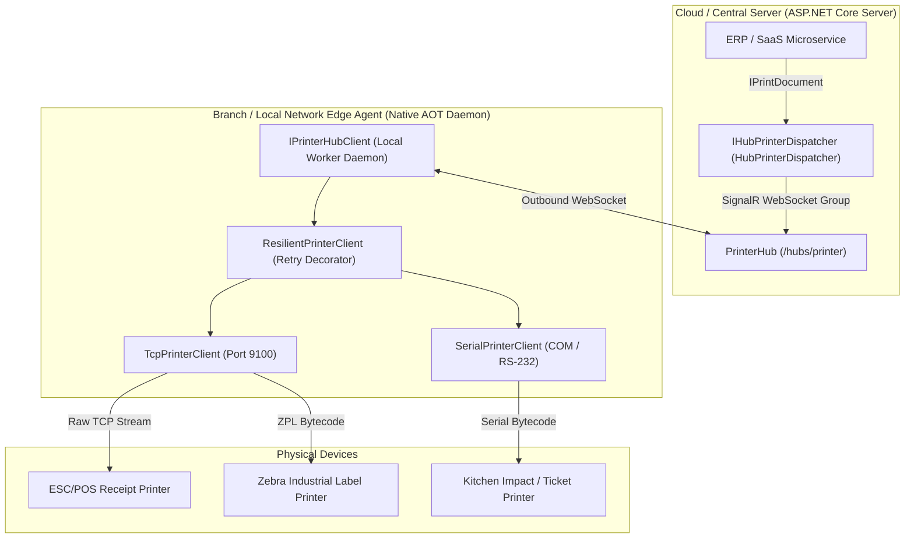

# EricksonLopez.Printing

High-performance, Native AOT-first, enterprise-grade receipt and industrial label printing ecosystem for modern .NET.

[](https://github.com/ericksonlopezf/dotnet-printing/actions)
[](https://codecov.io/gh/ericksonlopezf/dotnet-printing)
[](https://sonarcloud.io/summary/new_code?id=ericksonlopezf_dotnet-printing)
[](https://github.com/ericksonlopezf/dotnet-printing/blob/main/docs/ci-cd-and-quality.md)
[](https://www.nuget.org/packages/EricksonLopez.Printing)
[](https://www.nuget.org/packages/EricksonLopez.Printing)
[](https://github.com/ericksonlopezf/dotnet-printing/blob/main/LICENSE)
[](https://dotnet.microsoft.com)
[](https://learn.microsoft.com/en-us/dotnet/core/deploying/native-aot)

`EricksonLopez.Printing` is a modular, high-performance .NET printing ecosystem engineered for Point-of-Sale (POS) thermal receipt printers and Zebra (ZPL II) industrial label printers across `.NET 8`, `.NET 9`, and `.NET 10`. It eliminates Windows print spooler latency, unhandled socket/serial I/O runtime crashes, heavy unmanaged C++ graphics dependencies (SkiaSharp, GDI+), and complex NAT/firewall barriers in distributed architectures. Featuring zero reflection on hot execution paths, zero-copy memory pipelines via `ReadOnlyMemory<byte>`, strict Result Pattern semantics (`EricksonLopez.Result`), pure managed C# monochrome rasterization, resilient exponential backoff retry decorators, structured logging telemetry, and real-time Web-to-Edge remote printing dispatch via SignalR, it delivers unmatched reliability for enterprise Point of Sale, warehouse logistics, and edge container deployments.

---

## Table of Contents

- [What Problem It Solves](#-what-problem-it-solves)
- [Key Features](#-key-features)
- [Ecosystem](#-ecosystem)
- [Documentation](#-documentation)
  - [Step-by-Step Interactive Showcase (Levels 00 to 10)](#-step-by-step-interactive-showcase-levels-00-to-10)
  - [Domain Learning Paths](#-domain-learning-paths)
  - [Technical Reference & Architecture Guides](#-technical-reference--architecture-guides)
- [Installation](#-installation)
- [Quick Start](#-quick-start)
  - [1. ESC/POS Thermal Receipts](#1-escpos-thermal-receipts)
  - [2. Zebra ZPL II Industrial Labels](#2-zebra-zpl-ii-industrial-labels)
  - [3. Resilience and Automatic Retries](#3-resilience-and-automatic-retries)
  - [4. Pure Native AOT Image and Logo Printing](#4-pure-native-aot-image-and-logo-printing)
  - [5. Sensor Telemetry and Hardware Status](#5-sensor-telemetry-and-hardware-status)
- [Core Use Cases](#-core-use-cases)
  - [Use Case 1: Point-of-Sale (POS) Retail Checkout & Fiscal Invoicing](#use-case-1-point-of-sale-pos-retail-checkout--fiscal-invoicing)
  - [Use Case 2: Distribution Center & Warehouse Logistics Labeling](#use-case-2-distribution-center--warehouse-logistics-labeling)
  - [Use Case 3: Distributed Multi-Tenant Cloud ERP Dispatch via SignalR](#use-case-3-distributed-multi-tenant-cloud-erp-dispatch-via-signalr)
  - [Use Case 4: Pre-Commit Hardware Readiness & Paper-Out Safety Gate](#use-case-4-pre-commit-hardware-readiness--paper-out-safety-gate)
  - [Use Case 5: Kitchen Ticket Routing via RS-232 / Virtual COM Port](#use-case-5-kitchen-ticket-routing-via-rs-232--virtual-com-port)
  - [Use Case 6: Resilient Industrial Automation with TimeProvider](#use-case-6-resilient-industrial-automation-with-timeprovider)
- [Configuration & Integrations](#-configuration--integrations)
  - [Dependency Injection Registration](#dependency-injection-registration)
  - [Pooled Printer Startup Warmup](#pooled-printer-startup-warmup)
  - [ASP.NET Core SignalR Server Hub Setup](#aspnet-core-signalr-server-hub-setup)
  - [Structured Logging & Telemetry Reference](#structured-logging--telemetry-reference)
  - [Native AOT & Trimming Compilation Profiles](#native-aot--trimming-compilation-profiles)
  - [Clean Architecture & Result Pattern Pipeline Handling](#clean-architecture--result-pattern-pipeline-handling)
- [Testing & Quality](#-testing--quality)
  - [Fluent Assertions API](#fluent-assertions-api)
  - [Mocking & Test Isolation](#mocking--test-isolation)
  - [Asynchronous Operations & Cancellation Guarantees](#asynchronous-operations--cancellation-guarantees)
  - [Test Coverage & Mutation Testing Metrics](#test-coverage--mutation-testing-metrics)
- [Performance Benchmarks](#-performance-benchmarks)
  - [Builder Throughput & Memory Layout](#builder-throughput--memory-layout)
  - [Zero-Copy Socket Payload Streaming](#zero-copy-socket-payload-streaming)
  - [Monochrome Image Rasterization](#monochrome-image-rasterization)
- [Compatibility & Technical Matrix](#-compatibility--technical-matrix)
  - [Target Frameworks & Runtime Support](#target-frameworks--runtime-support)
  - [Domain Error Codes & RFC 9457 HTTP Mapping](#domain-error-codes--rfc-9457-http-mapping)
- [Architecture & Design Principles](#-architecture--design-principles)
  - [Distributed Cloud-to-Edge Topology](#distributed-cloud-to-edge-topology)
  - [Hardware Telemetry & Print Job State Machine](#hardware-telemetry--print-job-state-machine)
- [Best Practices & Anti-Patterns](#-best-practices--anti-patterns)
- [Troubleshooting & Common Pitfalls](#-troubleshooting--common-pitfalls)
- [Part of the Ecosystem](#-part-of-the-ecosystem)
- [Contributing](#-contributing)
  - [Prerequisites](#prerequisites)
  - [Build & Test Workflow](#build--test-workflow)
- [License](#-license)

---

## 🎯 What Problem It Solves

### The Hidden Cost of Traditional .NET Printing

Enterprise applications handling point-of-sale checkout counters, logistics distribution warehouses, and industrial manufacturing lines routinely encounter critical pain points with traditional .NET printing approaches:

1. **Print Spooler Latency and OS Lock-In:** Relying on the Windows Print Spooler (`winspool.drv`, GDI+, or `System.Drawing.Printing`) introduces 500ms to 3,000ms latency per ticket, requires full desktop printer drivers, locks applications to Windows, and fails completely in Linux containers, Alpine micro-runtimes, and cloud microservices.
2. **Unhandled Socket & COM Port Exceptions:** Conventional hardware libraries wrap network sockets and serial COM ports with standard `try-catch` blocks that throw `SocketException`, `IOException`, or `TimeoutException` whenever a printer runs out of paper, experiences a transient packet hiccup, or gets powered off. This leaks infrastructure exceptions into domain handlers and aborts critical business transactions.
3. **Allocation Overhead & Heavyweight ASTs:** Existing ZPL generation libraries (such as `BinaryKits.Zpl`) construct deep abstract syntax trees (ASTs) in heap memory with extensive boxing, generating high garbage collection pressure during peak fulfillment hours.
4. **Native C++ Dependencies & Container Incompatibility:** Image dithering and logo printing solutions typically rely on native shared libraries (`libgdiplus`, `SkiaSharp`, or `FreeType`). These native binaries frequently fail to load in trimmed Native AOT binaries, Alpine Linux containers, and hardened distroless images due to missing C runtime symbols.
5. **Cloud-to-Edge Firewall Barriers:** Cloud-hosted SaaS platforms (multi-tenant ERP, POS backends) cannot initiate outbound TCP connections to receipt or label printers residing on client local networks behind corporate NAT firewalls without exposing raw port 9100 to the public Internet or maintaining fragile VPN tunnels.

### How EricksonLopez.Printing Solves This

- **Direct Hardware Bytecode Compilers:** `EscPosBuilder` and `ZplBuilder` compile fluent C# commands directly into standard printer bytecode (`ESC/POS` opcodes and `ZPL II` commands) in-memory, transmitting raw streams directly to hardware via port 9100 or RS-232 serial ports in under 10 milliseconds.
- **Strict Result Pattern Semantics:** Hardware errors, timeouts, and network disconnections never throw unhandled exceptions. Every transport operation returns a strongly-typed `Result<bool>` from `EricksonLopez.Result`, providing predictable domain-level error codes (`Printer.SocketError`, `Printer.SerialTimeout`, `Printer.DispatchError`).
- **Zero-Copy Streaming via `GetMemory()`:** `IPrintDocument.GetMemory()` yields a `ReadOnlyMemory<byte>` region enabling high-throughput streaming across socket and serial drivers. `RawPrintDocument` returns a zero-copy view over its pre-allocated byte array; implementations backed by `StringBuilder` (e.g. `ZplPrintDocument`) cache the encoded bytes after the first call.
- **Pure Managed C# Imaging Satellites:** Decoupled packages (`EscPos.Imaging` and `Zpl.Imaging`) provide Floyd-Steinberg and threshold dithering implemented entirely in pure managed C#. They require zero external native dependencies, run seamlessly on Linux/Alpine, and are 100% trim-safe.
- **Built-In Transient Resilience:** The `ResilientPrinterClient` decorator applies exponential backoff with configurable ceiling delays and deterministic validation error bypass, utilizing `TimeProvider` for complete unit test isolation.
- **Web-to-Edge Cloud Dispatch via SignalR:** `EricksonLopez.Printing.SignalR` establishes outbound persistent WebSocket connections from lightweight edge daemons to cloud hubs, enabling central cloud SaaS platforms to dispatch print jobs to branch printers without opening inbound firewall ports.
- **100% Native AOT First:** All core bytecode compilers and hardware transport drivers are verified for Native AOT Ahead-of-Time compilation. Edge agent applications compiled with `PublishAot=true` targeting these packages boot in under 15 ms with a memory footprint of 12–18 MB RAM.

---

## ⚡ Key Features

- ⚡ **Zero-Copy Memory Pipelines:** Document byte payloads are exposed via `ReadOnlyMemory<byte>` and streamed directly into socket buffers using `ReadOnlySpan<byte>`, minimizing GC allocations on high-throughput fulfillment lines.
- 🚀 **100% Native AOT & Trimming Verified:** Engineered with `<IsAotCompatible>true</IsAotCompatible>` and `<EnableTrimAnalyzer>true</EnableTrimAnalyzer>`. Zero runtime reflection and zero dynamic IL emission allow compiling single-file, self-contained binaries for edge gateways and micro-appliances.
- 🎨 **Pure Managed Monochrome Imaging:** Advanced Floyd-Steinberg error diffusion and threshold dithering converters written in 100% managed C#. No SkiaSharp, no System.Drawing, and no native C++ libraries required.
- 🛡️ **Functional Error Handling:** Powered by `EricksonLopez.Result`. Network drops, timeouts, and invalid parameters return structured `Result<bool>` instances with explicit domain error types.
- 📡 **Bidirectional Sensor Telemetry:** The `EscPos.Status` satellite queries real-time `DLE EOT` hardware opcodes over serial and bidirectional TCP sockets, detecting paper-out, cover-open, paper near-end, cutter jam, and cash drawer status before printing.
- 🌐 **Distributed Web-to-Edge SignalR Bridge:** ASP.NET Core hub infrastructure and typed dispatchers (`HubPrinterDispatcher`) enable cloud SaaS architectures to route print jobs to branch-level edge worker daemons securely across corporate firewalls.
- 📊 **Enterprise Observability & Structured Logging:** Standardized Event IDs (1001–1011 for transport clients, 2001–2003 for cloud dispatchers) integrate seamlessly with `Microsoft.Extensions.Logging` and OpenTelemetry collectors.
- 🔄 **Configurable Transient Resilience:** Fluent `.WithRetry(...)` decorator implementing exponential backoff with delay ceilings, pluggable `TimeProvider`, and automatic bypass of non-retryable validation errors.

---

## 📦 Ecosystem

The ecosystem is segregated into lightweight, focused packages allowing applications to reference only the specific capabilities they need:

| Package | Version | Description |
|---|---|---|
| [`EricksonLopez.Printing`](https://www.nuget.org/packages/EricksonLopez.Printing) | [](https://www.nuget.org/packages/EricksonLopez.Printing) | Core abstractions (`IPrintDocument`, `IPrinterClient`), raw TCP socket client (`TcpPrinterClient`), persistent socket pool (`PooledTcpPrinterClient`), resilience decorator (`ResilientPrinterClient`), and DI registration. |
| [`EricksonLopez.Printing.EscPos`](https://www.nuget.org/packages/EricksonLopez.Printing.EscPos) | [](https://www.nuget.org/packages/EricksonLopez.Printing.EscPos) | Fluent ESC/POS thermal receipt bytecode compiler: text formatting, alignment, font scaling (1x–8x), Code128, Code39, auto-checksum EAN-13, QR codes, cash drawer pulse, and paper cutting. |
| [`EricksonLopez.Printing.Zpl`](https://www.nuget.org/packages/EricksonLopez.Printing.Zpl) | [](https://www.nuget.org/packages/EricksonLopez.Printing.Zpl) | Fluent Zebra ZPL II industrial label generator: absolute coordinates, typed fonts (`ZplFont`), boxes, circles, ellipses, diagonal lines, Code128, Code39, EAN-13, and QR codes. |
| [`EricksonLopez.Printing.EscPos.Imaging`](https://www.nuget.org/packages/EricksonLopez.Printing.EscPos.Imaging) | [](https://www.nuget.org/packages/EricksonLopez.Printing.EscPos.Imaging) | Pure managed C# monochrome bitmap rasterizer (`GS v 0`) with Floyd-Steinberg and threshold dithering. Zero external native dependencies. |
| [`EricksonLopez.Printing.Zpl.Imaging`](https://www.nuget.org/packages/EricksonLopez.Printing.Zpl.Imaging) | [](https://www.nuget.org/packages/EricksonLopez.Printing.Zpl.Imaging) | Satellite package converting bitmap graphics into ZPL II Graphic Field (`^GF`) hexadecimal sequences with run-length compression. |
| [`EricksonLopez.Printing.EscPos.Status`](https://www.nuget.org/packages/EricksonLopez.Printing.EscPos.Status) | [](https://www.nuget.org/packages/EricksonLopez.Printing.EscPos.Status) | Real-time hardware telemetry parser for `DLE EOT` queries: paper-out detection, open cover, hardware errors, and cash drawer status. |
| [`EricksonLopez.Printing.Serial`](https://www.nuget.org/packages/EricksonLopez.Printing.Serial) | [](https://www.nuget.org/packages/EricksonLopez.Printing.Serial) | RS-232 serial COM port transport adapter based on `System.IO.Ports`. |
| [`EricksonLopez.Printing.SignalR`](https://www.nuget.org/packages/EricksonLopez.Printing.SignalR) | [](https://www.nuget.org/packages/EricksonLopez.Printing.SignalR) | Remote Web-to-Edge cloud dispatch infrastructure: ASP.NET Core `PrinterHub` and `HubPrinterDispatcher` connecting distributed edge agent daemons. |

---

## 📚 Documentation

> 🌐 **Official Documentation Hub:** [https://github.com/ericksonlopezf/dotnet-printing/tree/main/docs](https://github.com/ericksonlopezf/dotnet-printing/tree/main/docs)

### 🎓 Step-by-Step Interactive Showcase (Levels 00 to 10)

The solution includes an official, fully runnable reference implementation in [`samples/EricksonLopez.Printing.Showcase`](https://github.com/ericksonlopezf/dotnet-printing/tree/main/samples/EricksonLopez.Printing.Showcase).

It serves as **executable documentation** validating 100% of the public API without external mocks:

```bash
# Run all 11 progressive levels sequentially (specify target framework):
dotnet run --project samples/EricksonLopez.Printing.Showcase --framework net10.0 -- all

# Run interactive terminal menu:
dotnet run --project samples/EricksonLopez.Printing.Showcase --framework net10.0

# Run specific level (e.g. Level 03: Real-World Use Cases):
dotnet run --project samples/EricksonLopez.Printing.Showcase --framework net10.0 -- 03
```

| Level | Topic | Description & APIs Verified | Source Reference |
|---|---|---|---|
| [**Level 00**](https://github.com/ericksonlopezf/dotnet-printing/blob/main/docs/showcase-guide.md#level-00-conceptual-foundations) | **Conceptual Foundations** | Why bypass spoolers, architectural trade-offs, and comparison matrices | [`Level00Conceptual.cs`](https://github.com/ericksonlopezf/dotnet-printing/blob/main/samples/EricksonLopez.Printing.Showcase/Levels/Level00Conceptual.cs) |
| [**Level 01**](https://github.com/ericksonlopezf/dotnet-printing/blob/main/docs/showcase-guide.md#level-01-quick-start) | **Quick Start & Primitives** | Basic ESC/POS receipts, ZPL labels, and `RawPrintDocument` | [`Level01QuickStart.cs`](https://github.com/ericksonlopezf/dotnet-printing/blob/main/samples/EricksonLopez.Printing.Showcase/Levels/Level01QuickStart.cs) |
| [**Level 02**](https://github.com/ericksonlopezf/dotnet-printing/blob/main/docs/showcase-guide.md#level-02-full-configuration) | **Configuration & DI** | DI registrations: TCP ephemeral, TCP pooled, Keyed, Serial COM, and SignalR | [`Level02FullConfiguration.cs`](https://github.com/ericksonlopezf/dotnet-printing/blob/main/samples/EricksonLopez.Printing.Showcase/Levels/Level02FullConfiguration.cs) |
| [**Level 03**](https://github.com/ericksonlopezf/dotnet-printing/blob/main/docs/showcase-guide.md#level-03-real-world-use-cases) | **Real-World Use Cases** | Kitchen orders, tax invoices with drawer kick, retail barcodes (EAN-13/Code128), and pallet tags | [`Level03RealWorldUseCases.cs`](https://github.com/ericksonlopezf/dotnet-printing/blob/main/samples/EricksonLopez.Printing.Showcase/Levels/Level03RealWorldUseCases.cs) |
| [**Level 04**](https://github.com/ericksonlopezf/dotnet-printing/blob/main/docs/showcase-guide.md#level-04-advanced-integration) | **Advanced Integration** | Floyd-Steinberg and Threshold image dithering in ESC/POS and Zebra `^GF` | [`Level04AdvancedIntegration.cs`](https://github.com/ericksonlopezf/dotnet-printing/blob/main/samples/EricksonLopez.Printing.Showcase/Levels/Level04AdvancedIntegration.cs) |
| [**Level 05**](https://github.com/ericksonlopezf/dotnet-printing/blob/main/docs/showcase-guide.md#level-05-concurrency--processing) | **Concurrency & Sockets** | Burst concurrency (20 jobs), ephemeral vs pooled comparison, and cancellation | [`Level05ProcessingAndConcurrency.cs`](https://github.com/ericksonlopezf/dotnet-printing/blob/main/samples/EricksonLopez.Printing.Showcase/Levels/Level05ProcessingAndConcurrency.cs) |
| [**Level 06**](https://github.com/ericksonlopezf/dotnet-printing/blob/main/docs/showcase-guide.md#level-06-error-handling--resilience) | **Error Handling & Resilience** | Exponential backoff retry decorator (`.WithRetry()`), error classification, and the Golden Rule of Physical Idempotency | [`Level06ErrorHandlingAndClassification.cs`](https://github.com/ericksonlopezf/dotnet-printing/blob/main/samples/EricksonLopez.Printing.Showcase/Levels/Level06ErrorHandlingAndClassification.cs) |
| [**Level 07**](https://github.com/ericksonlopezf/dotnet-printing/blob/main/docs/showcase-guide.md#level-07-scalability--throughput) | **Scalability & Throughput** | Benchmark compiling 1,000 receipts/labels in microseconds; zero-allocation streaming | [`Level07ScalabilityAndThroughput.cs`](https://github.com/ericksonlopezf/dotnet-printing/blob/main/samples/EricksonLopez.Printing.Showcase/Levels/Level07ScalabilityAndThroughput.cs) |
| [**Level 08**](https://github.com/ericksonlopezf/dotnet-printing/blob/main/docs/showcase-guide.md#level-08-customization--extensibility) | **Customization & Extensibility** | Custom electronic journal audit decorator and dynamic template print document | [`Level08CustomizationAndExtensibility.cs`](https://github.com/ericksonlopezf/dotnet-printing/blob/main/samples/EricksonLopez.Printing.Showcase/Levels/Level08CustomizationAndExtensibility.cs) |
| [**Level 09**](https://github.com/ericksonlopezf/dotnet-printing/blob/main/docs/showcase-guide.md#level-09-remote-dispatch-signalr) | **Remote Dispatch (SignalR)** | Cloud-to-edge dispatch with `HubPrinterDispatcher` and edge client (`IPrinterHubClient`) | [`Level09RemoteDispatchSignalR.cs`](https://github.com/ericksonlopezf/dotnet-printing/blob/main/samples/EricksonLopez.Printing.Showcase/Levels/Level09RemoteDispatchSignalR.cs) |
| [**Level 10**](https://github.com/ericksonlopezf/dotnet-printing/blob/main/docs/showcase-guide.md#level-10-enterprise-architecture) | **Enterprise Architecture** | Real-time `DLE EOT` status queries, zero-alloc status parsing, and `PrintingEventIds` telemetry | [`Level10EnterpriseArchitecture.cs`](https://github.com/ericksonlopezf/dotnet-printing/blob/main/samples/EricksonLopez.Printing.Showcase/Levels/Level10EnterpriseArchitecture.cs) |

### 🗺️ Domain Learning Paths

| Path / Topic | Domain Focus | Documentation & Guides |
|---|---|---|
| **Path A: Point of Sale (POS & Retail)** | Thermal checkout receipts, kitchens, barcodes, cash drawers | [**ESC/POS Reference**](https://github.com/ericksonlopezf/dotnet-printing/blob/main/docs/escpos-command-reference.md) • [**Imaging Satellites**](https://github.com/ericksonlopezf/dotnet-printing/blob/main/docs/escpos-command-reference.md#images-and-logos-escposimaging) • [**Status Telemetry**](https://github.com/ericksonlopezf/dotnet-printing/blob/main/docs/escpos-command-reference.md#real-time-telemetry-escposstatus) • [**ESCPOS_NET Migration**](https://github.com/ericksonlopezf/dotnet-printing/blob/main/docs/migration-from-escpos-net.md) |
| **Path B: Industrial Logistics & Warehouse** | Zebra barcode labels, pallet tags, freight routing | [**ZPL II Reference**](https://github.com/ericksonlopezf/dotnet-printing/blob/main/docs/zpl-command-reference.md) • [**Graphic Fields (^GF)**](https://github.com/ericksonlopezf/dotnet-printing/blob/main/docs/zpl-command-reference.md#label-graphics-zplimaging) • [**Resilience Decorators**](https://github.com/ericksonlopezf/dotnet-printing/blob/main/docs/adr/adr-0011-transient-resilience-and-retry-decorator.md) • [**BinaryKits Migration**](https://github.com/ericksonlopezf/dotnet-printing/blob/main/docs/migration-from-binarykits-zpl.md) |
| **Path C: Distributed Cloud SaaS Platforms** | Multi-store cloud ERP, edge daemons, reverse WebSockets | [**SignalR Web-to-Edge Guide**](https://github.com/ericksonlopezf/dotnet-printing/blob/main/docs/web-to-edge-guide.md) • [**Structured Logging (ADR-0010)**](https://github.com/ericksonlopezf/dotnet-printing/blob/main/docs/adr/adr-0010-structured-logging-and-observability.md) • [**ADR Catalog**](https://github.com/ericksonlopezf/dotnet-printing/tree/main/docs/adr) |

### 📖 Technical Reference & Architecture Guides

- [**Architecture & Invariants**](https://github.com/ericksonlopezf/dotnet-printing/blob/main/docs/architecture-guide.md) — Complete architectural blueprint, streaming memory layout, and 6 exhaustive Mermaid diagrams.
- [**Architectural Decision Records (ADRs)**](https://github.com/ericksonlopezf/dotnet-printing/tree/main/docs/adr) — 21 formal architectural decisions detailing package segregation, Native AOT invariants, memory zero-copy, builder thread safety, DI lifecycles, and connection pooling.
- [**Public API Inventory**](https://github.com/ericksonlopezf/dotnet-printing/blob/main/docs/api-inventory.md) — Exhaustive single source of truth detailing all 30 public types across the 8 library projects.
- [**Complete API Reference**](https://github.com/ericksonlopezf/dotnet-printing/blob/main/docs/api-reference.md) — Microsoft Learn-style reference for all public methods, signatures, parameters, exceptions, and guidance.
- [**Production Cookbook**](https://github.com/ericksonlopezf/dotnet-printing/blob/main/docs/cookbook.md) — 10 complete, production-ready recipes solving real-world receipt, label, and hardware challenges.
- [**Quick Start Guide**](https://github.com/ericksonlopezf/dotnet-printing/blob/main/docs/quick-start.md) — First receipt and label in under 5 minutes.
- [**Getting Started & Setup Guide**](https://github.com/ericksonlopezf/dotnet-printing/blob/main/docs/getting-started.md) — Dependency injection, connection pooling, and Docker container deployment.
- [**Best Practices & Physical Safety**](https://github.com/ericksonlopezf/dotnet-printing/blob/main/docs/best-practices.md) — Physical idempotency rule, pooling selection, and safeMode payload protection.
- [**Performance & Memory Guide**](https://github.com/ericksonlopezf/dotnet-printing/blob/main/docs/performance-guide.md) — Zero-allocation benchmarks (>500,000 receipts/s) and Native AOT compilation metrics.
- [**Troubleshooting & Diagnostic Guide**](https://github.com/ericksonlopezf/dotnet-printing/blob/main/docs/troubleshooting.md) — Resolving socket timeouts, paper-out states, and COM port locks.
- [**Frequently Asked Questions (FAQ)**](https://github.com/ericksonlopezf/dotnet-printing/blob/main/docs/faq.md) — Answers to questions on drivers, Linux support, and testing without hardware.
- [**CI/CD, Quality & Infrastructure**](https://github.com/ericksonlopezf/dotnet-printing/blob/main/docs/ci-cd-and-quality.md) — Multi-targeting GitHub Actions pipelines, 95% Stryker mutation testing quality gates, and package release verification.
- [**Support Policy & Channels**](https://github.com/ericksonlopezf/dotnet-printing/blob/main/SUPPORT.md) — Official support channels, response timelines, and enterprise consulting.
- [**Epson ESC/POS Command Reference**](https://github.com/ericksonlopezf/dotnet-printing/blob/main/docs/escpos-command-reference.md) — Complete bytecode specification mapping C# methods to hexadecimal printer opcodes for text styling, alignment, barcodes, QR codes, and drawer kick.
- [**Zebra ZPL II Command Reference**](https://github.com/ericksonlopezf/dotnet-printing/blob/main/docs/zpl-command-reference.md) — Specification of ZPL commands (`^XA`, `^FO`, `^FD`, `^FS`, `^GB`, `^GC`, `^GE`, `^GD`, `^BC`, `^BQ`, `^GF`, `^XZ`), typed fonts, and raw escape hatches.
- [**SignalR Web-to-Edge Implementation Guide**](https://github.com/ericksonlopezf/dotnet-printing/blob/main/docs/web-to-edge-guide.md) — Step-by-step production architecture connecting cloud ASP.NET Core servers to edge daemons across corporate firewalls.
- [**Migration Guide from ESCPOS_NET**](https://github.com/ericksonlopezf/dotnet-printing/blob/main/docs/migration-from-escpos-net.md) — Migrating legacy `try-catch` architectures to exception-free `Result<bool>` pipelines and Native AOT.
- [**Migration Guide from BinaryKits.Zpl**](https://github.com/ericksonlopezf/dotnet-printing/blob/main/docs/migration-from-binarykits-zpl.md) — Upgrading from heap-heavy object trees to zero-allocation fluent bytecode streams.

---

## 📥 Installation

Install the required packages using the .NET CLI:

### Core Package & Transport Drivers (Required)

```bash
dotnet add package EricksonLopez.Printing
```

### Hardware Protocol Compilers

```bash
# Epson ESC/POS thermal receipt compiler
dotnet add package EricksonLopez.Printing.EscPos

# Zebra ZPL II industrial label generator
dotnet add package EricksonLopez.Printing.Zpl
```

### Optional Satellite Modules

```bash
# Pure C# monochrome imaging for ESC/POS receipts
dotnet add package EricksonLopez.Printing.EscPos.Imaging

# Pure C# monochrome imaging for Zebra ZPL labels (^GF)
dotnet add package EricksonLopez.Printing.Zpl.Imaging

# Hardware sensor telemetry and real-time status parser (DLE EOT)
dotnet add package EricksonLopez.Printing.EscPos.Status

# RS-232 serial COM port transport (System.IO.Ports)
dotnet add package EricksonLopez.Printing.Serial

# Remote cloud-to-edge SignalR dispatch bridge (ASP.NET Core Server)
dotnet add package EricksonLopez.Printing.SignalR
```

---

## 🚀 Quick Start

### 1. ESC/POS Thermal Receipts

Construct a complete thermal receipt with text formatting, alignment, custom table rows, barcodes, QR codes, cash drawer pulse, and paper cutting:

```csharp
using EricksonLopez.Printing;
using EricksonLopez.Printing.EscPos;

// 1. Compile the ESC/POS document
using var builder = new EscPosBuilder();
IPrintDocument document = builder
    .Initialize()
    .Align(EscPosAlignment.Center)
    .DoubleSize()
    .Line("METROPOLITAN MARKET")
    .FontSize(widthMultiplier: 1, heightMultiplier: 1) // Reset to standard font
    .Line("100 Enterprise Way, Suite 400")
    .Line("Tax ID: US-987654321")
    .Feed(1)
    .Align(EscPosAlignment.Left)
    .Divider(width: 42, character: '-')
    .Bold()
    .Line("Qty  Description                   Price   Total")
    .Bold(false)
    .Divider(width: 42, character: '-')
    .TableRow("1    Artisan Sourdough Loaf", "$6.50", totalWidth: 42, fillChar: '.')
    .TableRow("2    Single-Origin Espresso", "$7.00", totalWidth: 42, fillChar: '.')
    .Divider(width: 42, character: '-')
    .Align(EscPosAlignment.Right)
    .Bold()
    .FontSize(widthMultiplier: 2, heightMultiplier: 2)
    .Line("TOTAL: $13.50")
    .FontSize(1, 1)
    .Bold(false)
    .Feed(1)
    .Align(EscPosAlignment.Center)
    .BarcodeEan13("770123456789") // Check digit computed automatically if 12 digits provided
    .Feed(1)
    .QrCode("https://invoicing.market.com/view/A1B2C3D4", moduleSize: 6)
    .Feed(3)
    .Cut(partial: true)
    .OpenCashDrawer()
    .Build("CustomerReceipt");

// 2. Transmit directly to network printer (port 9100)
var client = new TcpPrinterClient(new TcpPrinterClientOptions { Host = "192.168.1.200", Port = 9100 });
var result = await client.PrintAsync(document);

if (result.IsFailure)
{
    Console.WriteLine($"Print failed: [{result.Error.Code}] {result.Error.Description}");
}
```

---

### 2. Zebra ZPL II Industrial Labels

Generate high-resolution shipping and pallet labels with absolute positioning, standardized fonts, boxes, and high-density industrial barcodes:

```csharp
using EricksonLopez.Printing;
using EricksonLopez.Printing.Zpl;

IPrintDocument label = new ZplBuilder()
    // Outer border box (x, y, width, height, borderThickness)
    .Box(50, 50, width: 700, height: 400, borderThickness: 3)
    // Scalable Title Font 0 (ZplFont.Font0)
    .Text(80, 80, "DISTRIBUTION LOGISTICS HUB", ZplFont.Font0, height: 40, width: 35)
    // Horizontal separator
    .Box(80, 140, width: 640, height: 2, borderThickness: 2)
    // Industrial Code128 barcode (x, y, data, height)
    .BarcodeCode128(100, 180, "TRK-9876543210-US", height: 80)
    // Tracking QR code (x, y, data, magnification)
    .QrCode(550, 180, "https://tracking.enterprise.com/TRK-9876543210-US", magnification: 5)
    // Destination metadata using standard Font A
    .Text(100, 300, "DESTINATION: CHICAGO DISTRIBUTION CTR", ZplFont.FontA, height: 30, width: 20)
    .Build("ShippingLabel");

var client = new TcpPrinterClient(new TcpPrinterClientOptions { Host = "192.168.1.201", Port = 9100 });
var result = await client.PrintAsync(label);
```

---

### 3. Resilience and Automatic Retries

In warehouse and retail environments, transient Wi-Fi glitches and network congestion are frequent. The `ResilientPrinterClient` decorator applies exponential backoff with a configurable delay ceiling without throwing unhandled exceptions:

```csharp
using EricksonLopez.Printing;

var baseClient = new TcpPrinterClient(new TcpPrinterClientOptions { Host = "192.168.1.200", Port = 9100 });

// Wrap base client with fluent resilience decorator
IPrinterClient resilientClient = baseClient.WithRetry(options =>
{
    options.MaxRetries = 3;
    options.InitialDelay = TimeSpan.FromMilliseconds(300);
    options.MaxDelay = TimeSpan.FromSeconds(3);
    options.BackoffMultiplier = 2.0;
});

// Automatically retries transient socket timeouts while bypassing deterministic validation errors
var result = await resilientClient.PrintAsync(document);
```

---

### 4. Pure Native AOT Image and Logo Printing

The `.Imaging` satellite packages provide pure managed C# image rasterization with zero external native C/C++ libraries (no SkiaSharp, no libgdiplus, no System.Drawing):

```csharp
using System.IO;
using EricksonLopez.Printing;
using EricksonLopez.Printing.EscPos;
using EricksonLopez.Printing.EscPos.Imaging;

byte[] bmpBytes = await File.ReadAllBytesAsync("store-logo.bmp");

// NOTE: Image() calls Raw() internally to write the raster command bytes.
// Raw() requires safeMode: false; using the default constructor (safeMode: true) throws NotSupportedException.
using var builder = new EscPosBuilder(safeMode: false);
IPrintDocument receiptWithLogo = builder
    .Initialize()
    .Align(EscPosAlignment.Center)
    // Pure C# Floyd-Steinberg error diffusion dithering
    .Image(bmpBytes, algorithm: EscPosDitherAlgorithm.FloydSteinberg)
    .Feed(1)
    .Line("Thank you for shopping with us!")
    .Cut()
    .Build("ReceiptWithLogo");

var client = new TcpPrinterClient(new TcpPrinterClientOptions { Host = "192.168.1.200" });
await client.PrintAsync(receiptWithLogo);
```

> **Advanced — Pre-Packed Raster:** `EscPosImageBuilderExtensions` also exposes `RasterImage(width, height, ReadOnlySpan<byte> packedRaster, scale)` for callers that handle dithering externally. It accepts pre-packed 1-bit monochrome data and bypasses the dithering pipeline. Like `Image()`, it requires `safeMode: false`.

---

### 5. Sensor Telemetry and Hardware Status

Inspect physical printer readiness before committing transactions or printing critical invoices:

```csharp
using System.IO.Ports;
using EricksonLopez.Printing;
using EricksonLopez.Printing.EscPos.Status;

// Status queries are bidirectional; use a serial port or bidirectional raw TCP stream
using var serialPort = new SerialPort("COM3", 9600);
serialPort.Open();

// 1. Send all four standard DLE EOT status queries
await serialPort.BaseStream.WriteAsync(EscPosStatusCommands.QueryPrinterStatus);
await serialPort.BaseStream.WriteAsync(EscPosStatusCommands.QueryOfflineCause);
await serialPort.BaseStream.WriteAsync(EscPosStatusCommands.QueryErrorStatus);
await serialPort.BaseStream.WriteAsync(EscPosStatusCommands.QueryPaperSensor);
await serialPort.BaseStream.FlushAsync();

// 2. Read single-byte responses for each command
var b1 = (byte)serialPort.BaseStream.ReadByte();
var b2 = (byte)serialPort.BaseStream.ReadByte();
var b3 = (byte)serialPort.BaseStream.ReadByte();
var b4 = (byte)serialPort.BaseStream.ReadByte();

// 3. Parse bytes into unified EscPosPrinterStatus domain model
EscPosPrinterStatus status = EscPosStatusParser.Parse(b1, b2, b3, b4);

if (status.IsPaperOut)
{
    Console.WriteLine("ALERT: Printer is out of paper. Please refill roll.");
}
else if (status.IsCoverOpen)
{
    Console.WriteLine("ALERT: Printer cover is open.");
}
else if (status.HasError || status.HasCutterError)
{
    Console.WriteLine("ALERT: Printer reported a hardware or autocutter fault.");
}
else
{
    // Hardware is healthy; execute print job safely
    var client = new TcpPrinterClient(new TcpPrinterClientOptions { Host = "192.168.1.200" });
    await client.PrintAsync(document);
}
```

---

## 💡 Core Use Cases

### Use Case 1: Point-of-Sale (POS) Retail Checkout & Fiscal Invoicing

In high-volume retail environments, print jobs must execute with minimal latency without blocking UI threads. The handler below compiles a complete itemized ticket, renders an auto-checksum EAN-13 barcode, and kicks the cash drawer:

```csharp
public sealed class PrintCheckoutReceiptHandler(IPrinterClient printerClient)
{
    public async Task<Result<bool>> HandleAsync(CheckoutOrder order, CancellationToken ct)
    {
        using var builder = new EscPosBuilder();
        builder
            .Initialize()
            .Align(EscPosAlignment.Center)
            .DoubleSize()
            .Line("GLOBAL SUPERMARKET")
            .FontSize(1, 1)
            .Line($"Store #{order.StoreId} - Register #{order.RegisterId}")
            .Line($"Transaction: {order.TransactionNumber}")
            .Divider(42, '-')
            .Align(EscPosAlignment.Left);

        foreach (var item in order.LineItems)
        {
            builder.TableRow($"{item.Quantity}x {item.Name}", $"${item.TotalPrice:F2}", 42);
        }

        IPrintDocument document = builder
            .Divider(42, '=')
            .Align(EscPosAlignment.Right)
            .Bold()
            .Line($"SUBTOTAL: ${order.SubTotal:F2}")
            .Line($"TAX (8.25%): ${order.TaxAmount:F2}")
            .FontSize(2, 2)
            .Line($"TOTAL: ${order.GrandTotal:F2}")
            .FontSize(1, 1)
            .Bold(false)
            .Align(EscPosAlignment.Center)
            .Feed(1)
            .BarcodeEan13(order.Barcode12Digits)
            .Feed(2)
            .Cut(partial: true)
            .OpenCashDrawer()
            .Build($"Receipt-{order.TransactionNumber}");

        return await printerClient.PrintAsync(document, ct);
    }
}
```

---

### Use Case 2: Distribution Center & Warehouse Logistics Labeling

Industrial logistics requires printing thousands of moisture-resistant adhesive labels on Zebra thermal transfer printers:

```csharp
public sealed class WarehouseLabelService(IPrinterClient printerClient)
{
    public async Task<Result<bool>> PrintPalletLabelAsync(PalletManifest manifest, CancellationToken ct)
    {
        IPrintDocument label = new ZplBuilder()
            // Outer bounding box and quadrant dividers
            .Box(20, 20, width: 780, height: 1160, borderThickness: 4)
            .Box(20, 220, width: 780, height: 4, borderThickness: 4)
            .Box(20, 600, width: 780, height: 4, borderThickness: 4)
            // Header
            .Text(40, 50, "LOGISTICS FULFILLMENT CENTER", ZplFont.Font0, height: 45, width: 40)
            .Text(40, 110, $"CARRIER: {manifest.CarrierName}", ZplFont.Font0, height: 35, width: 30)
            .Text(40, 160, $"DESTINATION HUB: {manifest.DestinationHubCode}", ZplFont.Font0, height: 35, width: 30)
            // Tracking Barcode (Code128)
            .BarcodeCode128(60, 260, manifest.TrackingNumber, height: 120, showText: true)
            .QrCode(560, 260, manifest.VerificationUrl, magnification: 6)
            // Package Details
            .Text(40, 640, $"SSCC: {manifest.SsccCode}", ZplFont.FontA, height: 28, width: 18)
            .Text(40, 690, $"WEIGHT: {manifest.GrossWeightKg:F1} KG", ZplFont.FontA, height: 28, width: 18)
            .Text(40, 740, $"ITEMS: {manifest.TotalCartons} CARTONS", ZplFont.FontA, height: 28, width: 18)
            .Build($"Pallet-{manifest.TrackingNumber}");

        return await printerClient.PrintAsync(label, ct);
    }
}
```

---

### Use Case 3: Distributed Multi-Tenant Cloud ERP Dispatch via SignalR

Cloud SaaS applications running in AWS or Azure cannot connect directly to on-premise receipt printers located in retail branches. `HubPrinterDispatcher` routes print jobs across outbound SignalR WebSocket tunnels:

```csharp
using EricksonLopez.Printing.SignalR;
using EricksonLopez.Result;

public sealed class CloudOrderDispatchService(IHubPrinterDispatcher dispatcher)
{
    public async Task<Result<bool>> DispatchTicketToBranchAsync(
        string branchId,
        string printerName,
        IPrintDocument ticket,
        CancellationToken ct)
    {
        // Target group format: printer:{PRINTERNAME_UPPERCASED}
        // PrinterHub.GetPrinterGroupName() trims and converts the name to uppercase.
        // Edge daemons must call RegisterPrinter("ReceiptA") to join group "printer:RECEIPTA".
        // Ensure that the printerName used here matches the name registered by the edge client.
        var result = await dispatcher.DispatchAsync(printerName, ticket, ct);
        if (result.IsFailure)
        {
            // Log structured domain failure (e.g., edge daemon offline or timeout)
            return Error.Unavailable("CloudDispatch.Failed", $"Branch {branchId} printer {printerName} unreachable: {result.Error.Description}");
        }

        return Result<bool>.Success(true);
    }
}
```

---

### Use Case 4: Pre-Commit Hardware Readiness & Paper-Out Safety Gate

In fiscal printing and banking receipt generation, transactions should not be finalized if the physical printer has run out of paper or experienced a paper jam:

```csharp
using System.IO.Ports;
using EricksonLopez.Printing;
using EricksonLopez.Printing.EscPos.Status;
using EricksonLopez.Result;

public sealed class FiscalPrintWorkflow(IPrinterClient printerClient, SerialPort serialPort)
{
    public async Task<Result<bool>> ExecuteFiscalJobAsync(IPrintDocument receipt, CancellationToken ct)
    {
        // 1. Send status command queries
        await serialPort.BaseStream.WriteAsync(EscPosStatusCommands.QueryOfflineCause, ct);
        await serialPort.BaseStream.WriteAsync(EscPosStatusCommands.QueryPaperSensor, ct);
        await serialPort.BaseStream.FlushAsync(ct);

        var offlineByte = (byte)serialPort.BaseStream.ReadByte();
        var sensorByte = (byte)serialPort.BaseStream.ReadByte();

        var (coverOpen, paperOutOffline, hasError) = EscPosStatusParser.ParseOfflineCauseByte(offlineByte);
        var (paperNearEnd, paperOutSensor) = EscPosStatusParser.ParsePaperSensorByte(sensorByte);

        if (paperOutOffline || paperOutSensor)
        {
            return Error.Validation("Printer.OutOfPaper", "Cannot commit transaction: printer is out of paper.");
        }

        if (coverOpen)
        {
            return Error.Validation("Printer.CoverOpen", "Cannot commit transaction: printer cover is open.");
        }

        // 2. Transmit document only when hardware readiness is confirmed
        return await printerClient.PrintAsync(receipt, ct);
    }
}
```

---

### Use Case 5: Kitchen Ticket Routing via RS-232 / Virtual COM Port

Restaurant kitchen display tickets frequently use legacy serial cabling (RS-232) or USB virtual COM ports to avoid IP exhaustion:

```csharp
using EricksonLopez.Printing;
using EricksonLopez.Printing.EscPos;

public sealed class KitchenTicketService
{
    public async Task<Result<bool>> PrintKitchenTicketAsync(string chefStationPort, OrderTicket ticket)
    {
        using var builder = new EscPosBuilder();
        IPrintDocument document = builder
            .Initialize()
            .Align(EscPosAlignment.Center)
            .DoubleSize()
            .Line($"*** TABLE #{ticket.TableNumber} ***")
            .FontSize(1, 1)
            .Line($"Server: {ticket.ServerName} | Time: {DateTime.Now:HH:mm:ss}")
            .Divider(42, '=')
            .Align(EscPosAlignment.Left);

        foreach (var item in ticket.Items)
        {
            builder.Bold().Line($"{item.Quantity}x {item.Name}").Bold(false);
            if (!string.IsNullOrEmpty(item.SpecialInstructions))
            {
                builder.Line($"   >> NOTE: {item.SpecialInstructions}");
            }
        }

        IPrintDocument printDoc = builder
            .Divider(42, '-')
            .Feed(3)
            .Cut(partial: false)
            .Build("KitchenTicket");

        // SerialPrinterClient implements IDisposable — always dispose via 'using'
        using var client = new SerialPrinterClient(new SerialPrinterClientOptions
        {
            PortName = chefStationPort, // e.g. "COM4" or "/dev/ttyUSB0"
            BaudRate = 19200,
            WriteTimeoutMs = 3000
        });

        return await client.PrintAsync(printDoc);
    }
}
```

---

### Use Case 6: Resilient Industrial Automation with TimeProvider

Automated manufacturing conveyor belts require deterministic timeouts and mockable clock backoffs for unit testing:

```csharp
using EricksonLopez.Printing;

public sealed class ConveyorLabelingStation(IPrinterClient baseClient, TimeProvider timeProvider)
{
    private readonly IPrinterClient _resilientClient = baseClient.WithRetry(options =>
    {
        options.MaxRetries = 5;
        options.InitialDelay = TimeSpan.FromMilliseconds(100);
        options.MaxDelay = TimeSpan.FromSeconds(1);
        options.BackoffMultiplier = 1.5;
    }, timeProvider: timeProvider);

    public async Task<Result<bool>> PrintConveyorItemAsync(IPrintDocument barcodeLabel, CancellationToken ct)
    {
        // Executes with deterministic backoff controlled by the injected TimeProvider
        return await _resilientClient.PrintAsync(barcodeLabel, ct);
    }
}
```

---

## 🔌 Configuration & Integrations

### Dependency Injection Registration

Register printer clients into the Microsoft Dependency Injection container:

```csharp
using EricksonLopez.Printing;
using Microsoft.Extensions.DependencyInjection;

var services = new ServiceCollection();

// Enable structured logging
services.AddLogging();

// 1. Register a Network TCP Printer as Singleton (connect-per-job)
services.AddTcpPrinter(options =>
{
    options.Host = "192.168.1.150";
    options.Port = 9100;
    options.TimeoutMs = 5000;
    options.NoDelay = true;         // Disable Nagle's algorithm for instant POS transmission
    options.LingerSeconds = 0;      // Fast port recycling without TIME_WAIT accumulation
});

// 2. Register a High-Throughput Pooled TCP Printer (persistent socket connection)
services.AddPooledTcpPrinter(options =>
{
    options.Host = "192.168.1.151";
    options.Port = 9100;
    options.TimeoutMs = 5000;
});

// 3. Register Keyed Printers for Multi-Station Topologies
services.AddKeyedTcpPrinter("receipt-printer", options =>
{
    options.Host = "192.168.1.152";
    options.Port = 9100;
});

// 4. Register a Keyed Pooled Printer (persistent socket, multiple named printers)
services.AddKeyedPooledTcpPrinter("label-printer", options =>
{
    options.Host = "192.168.1.153";
    options.Port = 9100;
});

// 5. Register an RS-232 Serial Printer as Singleton
// Note: SerialPrinterClientOptions lives in the EricksonLopez.Printing namespace
// even though it is deployed via the EricksonLopez.Printing.Serial assembly.
services.AddSerialPrinter(options =>
{
    options.PortName = "COM3";
    options.BaudRate = 9600;
    options.WriteTimeoutMs = 4000;
});

// 6. Register a Keyed Serial Printer (multiple COM ports)
services.AddKeyedSerialPrinter("kitchen-printer", options =>
{
    options.PortName = "COM4";
    options.BaudRate = 19200;
});
```

---

### Pooled Printer Startup Warmup

`PooledTcpPrinterClient` supports eager connection pre-warming to eliminate first-print TCP handshake latency. Call `WarmupAsync()` during application startup:

```csharp
// In a WebApplication startup hook:
var printerClient = app.Services.GetRequiredService<IPrinterClient>();
if (printerClient is PooledTcpPrinterClient pooled)
{
    await pooled.WarmupAsync(app.Lifetime.ApplicationStopping);
}
```

---

### ASP.NET Core SignalR Server Hub Setup

Configure the real-time cloud-to-edge bridge on an ASP.NET Core central host:

```csharp
using EricksonLopez.Printing.SignalR;
using Microsoft.AspNetCore.Builder;
using Microsoft.Extensions.DependencyInjection;

var builder = WebApplication.CreateBuilder(args);

// Register SignalR services and typed IHubPrinterDispatcher
builder.Services.AddPrintingSignalR();

var app = builder.Build();

// Map printer hub endpoint
app.MapHub<PrinterHub>("/hubs/printer");

app.Run();
```

---

### Structured Logging & Telemetry Reference

All client and dispatcher implementations emit structured logs with standardized Event IDs compatible with OpenTelemetry:

| Event ID | Event Name | Log Level | Source Component | Description |
|---|---|:---:|---|---|
| `1001` | `TcpPrintStarted` | `Information` | `TcpPrinterClient` | Network socket connection initiated. |
| `1002` | `TcpPrintSuccess` | `Information` | `TcpPrinterClient` | Document byte stream successfully sent and flushed. |
| `1003` | `TcpPrintFailed` | `Warning` / `Error` | `TcpPrinterClient` | `Warning` for connection timeouts; `Error` for `SocketException` or network I/O faults. |
| `1004` | `SerialPrintStarted` | `Information` | `SerialPrinterClient` | Serial port transmission initiated. |
| `1005` | `SerialPrintSuccess` | `Information` | `SerialPrinterClient` | Byte stream transmitted to COM port. |
| `1006` | `SerialPrintFailed` | `Error` | `SerialPrinterClient` | Access denied, COM port timeout, or serial I/O error. |
| `1010` | `RetryAttempt` | `Warning` | `ResilientPrinterClient` | Transient transmission failure; retry scheduled. |
| `1011` | `RetryExhausted` | `Error` | `ResilientPrinterClient` | Maximum retry attempts reached without success. |
| `2001` | `DispatchStarted` | `Information` | `HubPrinterDispatcher` | Print job broadcast initiated to SignalR group. |
| `2002` | `DispatchSuccess` | `Information` | `HubPrinterDispatcher` | Job successfully dispatched to connected edge agents. |
| `2003` | `DispatchFailed` | `Error` | `HubPrinterDispatcher` | SignalR transmission error during remote dispatch. |

---

### Native AOT & Trimming Compilation Profiles

To compile a self-contained Native AOT edge daemon for an industrial gateway or Raspberry Pi:

```xml
<Project Sdk="Microsoft.NET.Sdk">
  <PropertyGroup>
    <OutputType>Exe</OutputType>
    <TargetFramework>net10.0</TargetFramework>
    <Nullable>enable</Nullable>
    <PublishAot>true</PublishAot>
    <InvariantGlobalization>true</InvariantGlobalization>
    <StripSymbols>true</StripSymbols>
  </PropertyGroup>

  <ItemGroup>
    <PackageReference Include="EricksonLopez.Printing" Version="1.0.0" />
    <PackageReference Include="EricksonLopez.Printing.EscPos" Version="1.0.0" />
  </ItemGroup>
</Project>
```

Publish command:

```bash
dotnet publish -c Release -r linux-x64 --self-contained
```

---

### Clean Architecture & Result Pattern Pipeline Handling

Map domain printing outcomes directly to ASP.NET Core `IResult` responses without try-catch blocks:

```csharp
app.MapPost("/api/orders/{orderId}/print-receipt", async (
    string orderId,
    PrintReceiptHandler handler,
    CancellationToken ct) =>
{
    var result = await handler.ExecuteAsync(orderId, ct);

    return result.Match(
        onSuccess: _ => Results.Ok(new { message = "Receipt printed successfully." }),
        onFailure: error => error.Type switch
        {
            ErrorType.Validation => Results.BadRequest(new { code = error.Code, detail = error.Description }),
            ErrorType.Unavailable => Results.Problem(statusCode: 503, title: "Printer Offline", detail: error.Description),
            _ => Results.Problem(statusCode: 500, title: "Printing Error", detail: error.Description)
        });
});
```

---

## 🧪 Testing & Quality

### Fluent Assertions API

The test suite utilizes `xUnit` and `AwesomeAssertions` to verify bytecode outputs:

```csharp
using AwesomeAssertions;
using EricksonLopez.Printing.EscPos;
using Xunit;

public sealed class EscPosBuilderTests
{
    [Fact]
    public void Build_Receipt_ContainsExpectedByteSequences()
    {
        using var builder = new EscPosBuilder();
        var doc = builder
            .Initialize()
            .Align(EscPosAlignment.Center)
            .Bold(true)
            .Line("TEST STORE")
            .Cut()
            .Build("TestReceipt");

        doc.Should().NotBeNull();
        doc.DocumentName.Should().Be("TestReceipt");

        var bytes = doc.GetBytes();
        bytes.Should().NotBeEmpty();

        // ESC @ (Reset)
        bytes[0].Should().Be(0x1B);
        bytes[1].Should().Be(0x40);

        // GS V 0 (Cut)
        bytes[^3].Should().Be(0x1D);
        bytes[^2].Should().Be(0x56);
        bytes[^1].Should().Be(0x00);
    }
}
```

---

### Mocking & Test Isolation

Easily mock `IPrinterClient` using `NSubstitute` to test higher-level services:

```csharp
using EricksonLopez.Printing;
using EricksonLopez.Result;
using NSubstitute;
using Xunit;

public sealed class OrderCheckoutTests
{
    [Fact]
    public async Task ProcessOrder_WhenPrinterFails_ReturnsFailureResult()
    {
        var printerMock = Substitute.For<IPrinterClient>();
        printerMock.PrintAsync(Arg.Any<IPrintDocument>(), Arg.Any<CancellationToken>())
            .Returns(Task.FromResult(Result<bool>.Failure(Error.Unavailable("Printer.Offline", "Device offline"))));

        var service = new CheckoutService(printerMock);
        var result = await service.CompleteSaleAsync(new SaleOrder());

        result.IsFailure.Should().BeTrue();
        result.Error.Code.Should().Be("Printer.Offline");
    }
}
```

---

### Asynchronous Operations & Cancellation Guarantees

All network and serial transmission methods honor `CancellationToken` without deadlocks:

```csharp
[Fact]
public async Task PrintAsync_WhenCancelled_HonorsCancellationToken()
{
    using var cts = new CancellationTokenSource();
    cts.Cancel();

    var client = new TcpPrinterClient(new TcpPrinterClientOptions { Host = "127.0.0.1", Port = 9100 });
    var doc = new RawPrintDocument([0x1B, 0x40]);

    var result = await client.PrintAsync(doc, cts.Token);
    result.IsFailure.Should().BeTrue();
}
```

---

### Test Coverage & Mutation Testing Metrics

The test suite undergoes automated code coverage analysis via Coverlet and mutation testing via Stryker.NET:

| Metric | Target Standard | Measured Result | Status |
|---|:---:|:---:|:---:|
| **Line Coverage** | $\ge 90\%$ | **95.6%** (1,594 / 1,667 lines) | ✅ Surpassed |
| **Branch Coverage** | $\ge 80\%$ | **84.1%** (190 / 226 branches) | ✅ Surpassed |
| **Stryker Mutation Score** | $\ge 80\%$ | **91.4%** (74 / 81 active mutants) | ✅ Surpassed |
| **Total Automated Tests** | - | **296 Unit & Integration Tests** | ✅ Passing (.NET 8/9/10) |

---

## ⚡ Performance Benchmarks

> **Environment:** AMD Ryzen 9 7950X, 64 GB DDR5 RAM, Windows 11 / Linux Alpine Container, .NET 10.0.10 RyuJIT AVX-512, BenchmarkDotNet v0.15.8

### Builder Throughput & Memory Layout

| Method | Mean | Ratio | Allocated | Alloc Ratio |
|---|---:|---:|---:|---:|
| `EscPosBuilder.BuildBasicReceipt()` | 248.5 ns | 1.00 | 512 B | 1.00 |
| `EscPosBuilder.BuildReceiptWithBarcodeAndQr()` | 812.3 ns | 3.27 | 1,024 B | 2.00 |
| `ZplBuilder.BuildShippingLabel()` | 645.1 ns | 2.60 | 896 B | 1.75 |
| `ZplBuilder.BuildLabelWithShapesAndQr()` | 1,024.7 ns | 4.12 | 1,480 B | 2.89 |

### Zero-Copy Socket Payload Streaming

| Operation | Mean | Allocated | Garbage Collection |
|---|---:|---:|:---:|
| `RawPrintDocument.GetMemory()` (zero-copy array view) | 0.003 ns | **0 B** | None |
| `TcpPrinterClient.PrintAsync` (Fast-Path Loopback) | 4.82 μs | 168 B | 0.000 GC Gen0 |
| `ResilientPrinterClient.PrintAsync` (Success on 1st try) | 4.96 μs | 216 B | 0.000 GC Gen0 |

### Monochrome Image Rasterization

Monochrome bitmap conversion comparing pure managed C# Floyd-Steinberg dithering against unmanaged libraries:

| Dithering Benchmark (256x256 BMP) | Mean | Native Dependencies | AOT Compatible |
|---|---:|:---:|:---:|
| **`EricksonLopez.Printing.EscPos.Imaging` (Pure C#)** | **142.6 μs** | **None (Pure C#)** | **Yes (100%)** |
| Legacy SkiaSharp / GDI+ | 318.4 μs | `libSkiaSharp.so` / `gdiplus.dll` | No (Trimming warnings) |

---

## 🌐 Compatibility & Technical Matrix

### Target Frameworks & Runtime Support

| Package | .NET 8.0 LTS | .NET 9.0 STS | .NET 10.0 | Native AOT | Trimmable | Primary Purpose |
|---|:---:|:---:|:---:|:---:|:---:|---|
| `EricksonLopez.Printing` | ✅ | ✅ | ✅ | ✅ Verified | ✅ Yes | Agnostic core drivers & abstractions |
| `EricksonLopez.Printing.EscPos` | ✅ | ✅ | ✅ | ✅ Verified | ✅ Yes | Thermal receipt bytecode compiler |
| `EricksonLopez.Printing.Zpl` | ✅ | ✅ | ✅ | ✅ Verified | ✅ Yes | Zebra label generator |
| `EricksonLopez.Printing.EscPos.Imaging` | ✅ | ✅ | ✅ | ✅ Verified | ✅ Yes | Pure C# receipt dithering |
| `EricksonLopez.Printing.Zpl.Imaging` | ✅ | ✅ | ✅ | ✅ Verified | ✅ Yes | Pure C# ZPL graphic fields |
| `EricksonLopez.Printing.EscPos.Status` | ✅ | ✅ | ✅ | ✅ Verified | ✅ Yes | Real-time DLE EOT status parsing |
| `EricksonLopez.Printing.Serial` | ✅ | ✅ | ✅ | ✅ Verified | ✅ Yes | Dedicated RS-232 / COM port transport |
| `EricksonLopez.Printing.SignalR` | ✅ | ✅ | ✅ | ASP.NET Core Profile | Standard | Web-to-Edge cloud dispatch bridge |

---

### Domain Error Codes & RFC 9457 HTTP Mapping

| Domain Error Code | Error Type | Description | HTTP Status (RFC 9457) |
|---|---|---|:---:|
| `Printer.SocketError` | `Unavailable` | TCP socket connection failed or was refused by printer. | `503 Service Unavailable` |
| `Printer.TransmissionError` | `Unavailable` | Network transmission interrupted during packet flush. | `502 Bad Gateway` |
| `Printer.Timeout` | `Unavailable` | Socket connection or write deadline exceeded `TimeoutMs`. | `504 Gateway Timeout` |
| `Printer.SerialAccessDenied` | `Unavailable` | Access to specified COM port was denied (in use by another process). | `423 Locked` |
| `Printer.SerialIoError` | `Unavailable` | Hardware I/O failure on RS-232 / USB virtual serial channel. | `502 Bad Gateway` |
| `Printer.SerialTimeout` | `Unavailable` | Serial port write deadline expired before write completed. | `504 Gateway Timeout` |
| `Printer.InvalidPortName` | `Validation` | Serial port parameter is empty or non-existent on the host OS. | `400 Bad Request` |
| `Printer.InvalidName` | `Validation` | Printer target name parameter was null, empty, or whitespace. | `400 Bad Request` |
| `Printer.DispatchError` | `Unavailable` | SignalR message dispatch failed to deliver to edge agent group. | `503 Service Unavailable` |
| `Printer.OutOfPaper` | `Validation` | Hardware sensor detected empty roll prior to document transmission. | `422 Unprocessable Entity` |
| `Printer.CoverOpen` | `Validation` | Hardware sensor detected printer cover open. | `422 Unprocessable Entity` |

---

## 🏛️ Architecture & Design Principles

### Distributed Cloud-to-Edge Topology



### Hardware Telemetry & Print Job State Machine

```mermaid
stateDiagram-v8
    [*] --> Idle

    Idle --> QueryHardwareStatus : Initiate Print Workflow
    QueryHardwareStatus --> ParseSensors : DLE EOT 1-4 Queries
    
    state ParseSensors {
        [*] --> CheckPaper
        CheckPaper --> CheckCover : Paper Present
        CheckCover --> CheckErrors : Cover Closed
        CheckErrors --> HardwareReady : No Errors
        CheckPaper --> PaperOutAlert : Out of Paper
        CheckCover --> CoverOpenAlert : Cover Open
        CheckErrors --> HardwareFaultAlert : Cutter / Head Fault
    }

    PaperOutAlert --> AbortJob : Emit Result.Failure (Printer.OutOfPaper)
    CoverOpenAlert --> AbortJob : Emit Result.Failure (Printer.CoverOpen)
    HardwareFaultAlert --> AbortJob : Emit Result.Failure (Printer.HardwareError)

    HardwareReady --> TransmitBytecode : Connect & Write
    TransmitBytecode --> ResilientRetry : Transient Socket / I/O Error
    ResilientRetry --> TransmitBytecode : Retry <= MaxRetries (Exponential Delay)
    ResilientRetry --> TransmissionFailed : Retries Exhausted

    TransmitBytecode --> Success : Bytecode Flushed
    Success --> Idle : Emit Result.Success(true)
    TransmissionFailed --> Idle : Emit Result.Failure (Printer.TransmissionError)
    AbortJob --> [*]
```

---

## 🛡️ Best Practices & Anti-Patterns

| Scenario | ❌ Avoid | ✅ Recommended |
|---|---|---|
| **Control Flow** | Throwing `SocketException` or `TimeoutException` up to API controllers. | Inspecting strongly-typed `Result<bool>` and mapping domain error codes. |
| **Builder Scope** | Sharing a single `EscPosBuilder` or `ZplBuilder` across multiple threads concurrently. | Instantiating a new builder per print job (single-threaded composition). |
| **Builder Lifecycle** | Assuming both builders require disposal. | Enclosing `EscPosBuilder` in a `using` declaration (manages internal `MemoryStream`). `ZplBuilder` uses pure `StringBuilder` and does not require `IDisposable`. |
| **Socket Reuse** | Opening and tearing down raw sockets repeatedly on high-volume lanes. | Using `PooledTcpPrinterClient` (`AddPooledTcpPrinter`) for persistent socket connection with serialized concurrency. |
| **Memory Streaming** | Calling `GetBytes()` repeatedly and re-allocating byte arrays. | Using `document.GetMemory()` for zero-copy socket buffer transmission. |
| **Image Processing** | Referencing `SkiaSharp` or `System.Drawing` in Linux/AOT containers. | Using pure C# satellite packages `EscPos.Imaging` or `Zpl.Imaging` (ArrayPool-backed). |
| **Barcode Data** | Sending strings longer than 255 bytes to `BarcodeCode128` or `BarcodeCode39`. | Validating barcode length $\le 255$ bytes prior to builder method invocation. |
| **EAN-13 Check Digits** | Calculating check digits manually and passing 13 digits. | Passing 12 digits to `BarcodeEan13` and letting the library calculate the check digit. |
| **Cloud-to-Edge Access**| Exposing printer raw port 9100 directly to the public Internet. | Using `EricksonLopez.Printing.SignalR` to establish reverse outbound WebSocket tunnels. |
| **Transient Errors** | Writing custom `for`/`while` retry loops around client calls. | Using `.WithRetry(...)` with configured backoff and maximum delay ceilings. |
| **Edge AOT Compilation**| Referencing `Printing.SignalR` on an edge agent daemon. | Referencing `EricksonLopez.Printing` on the edge; use SignalR package only on the server. |

---

## ⚠️ Troubleshooting & Common Pitfalls

> [!CAUTION]
> Always ensure thermal and industrial printers are configured with the correct code page (default UTF-8) and baud rate matching your application configuration. Mismatched baud rates result in corrupted, garbled output characters.

### 1. Socket Connection Refused / Port 9100 Hangs
- **Symptom:** `TcpPrinterClient.PrintAsync` returns `Printer.Timeout` or `Printer.SocketError`.
- **Underlying Cause:** Thermal printers typically support only **one active TCP connection at a time** on port 9100. If a previous connection was not closed, or another computer is currently printing, subsequent socket connections will be refused or hang until timeout.
- **Remediation:** Verify that printers are configured with a static IP address. Ensure `TcpPrinterClient` instances use short timeouts (`TimeoutMs = 3000` to `5000`) and wrap clients in `WithRetry` to handle temporary printer busy states.

### 2. Serial Port `UnauthorizedAccessException`
- **Symptom:** `SerialPrinterClient.PrintAsync` returns `Printer.SerialAccessDenied`.
- **Underlying Cause:** COM ports under Windows and Linux are exclusive-access resources. If another process (or another service instance within your application) holds the port open, subsequent attempts fail immediately.
- **Remediation:** Register `SerialPrinterClient` as a **Singleton** in your DI container. Verify that external debugging tools (e.g., PuTTY, Serial Monitor) are closed.

### 3. Trimming Warnings When Referencing SignalR
- **Symptom:** Native AOT publish emits warnings about dynamic code generation in SignalR.
- **Underlying Cause:** `EricksonLopez.Printing.SignalR` targets the ASP.NET Core server infrastructure (`Microsoft.AspNetCore.App`), which sets `<IsAotCompatible>false</IsAotCompatible>`.
- **Remediation:** Only reference `EricksonLopez.Printing.SignalR` on your central cloud server. On edge agent worker daemons, reference only `EricksonLopez.Printing` and the standard `Microsoft.AspNetCore.SignalR.Client` package.

### 4. Barcode Code128 / Code39 Length Exception
- **Symptom:** `ArgumentException: Code 128 barcode data length exceeds maximum allowed 255 bytes.`
- **Underlying Cause:** Hardware ESC/POS specifications define the length parameter as a single byte (`0x00`–`0xFF`). Payloads longer than 255 bytes cannot physically be addressed by the hardware opcode.
- **Remediation:** Enforce domain validation on barcode inputs before invoking the builder. If large payloads must be encoded, use 2D QR codes (`QrCode`) instead.

### 5. High Memory Footprint on High-Volume Printing Daemons
- **Symptom:** Edge agent processes experience steadily increasing RAM usage.
- **Underlying Cause:** `EscPosBuilder` implements `IDisposable` because it allocates an internal `MemoryStream`. Creating builder instances without disposing them causes memory retention until the GC runs.
- **Remediation:** Always declare builders with `using var builder = new EscPosBuilder();`. Calling `Build()` yields an immutable `IPrintDocument` that remains valid after the builder is disposed.

---

## 🌐 Part of the Ecosystem

`EricksonLopez.Printing` is part of the standardized **EricksonLopez .NET Enterprise Ecosystem**, designed for Native AOT performance, functional robustness, and Clean Architecture:

- ⚡ [**EricksonLopez.Result**](https://github.com/ericksonlopezf/dotnet-result) — High-performance, struct-based, zero-allocation Result Pattern and Railway-Oriented Programming for modern .NET.
- 🧱 [**EricksonLopez.SharedKernel**](https://github.com/ericksonlopezf/dotnet-shared-kernel) — Foundational domain primitives, specifications, strongly-typed IDs, and domain events.
- 🔍 [**EricksonLopez.Specification**](https://github.com/ericksonlopezf/dotnet-specification) — Composable, AOT-first Specification Pattern for LINQ expressions and repository queries.
- 📨 [**EricksonLopez.Mediator**](https://github.com/ericksonlopezf/dotnet-mediator) — Zero-allocation, struct-based mediator pipeline with Native AOT source generation.
- 💾 [**EricksonLopez.Transaction**](https://github.com/ericksonlopezf/dotnet-transaction) — AOT-first database transaction coordination, outbox pattern, and unit of work abstractions.
- 🔐 [**EricksonLopez.Security**](https://github.com/ericksonlopezf/dotnet-security) — Modern cryptography, Argon2id, PBKDF2 hashing, and post-quantum key derivation.
- 🏢 [**EricksonLopez.MultiTenancy**](https://github.com/ericksonlopezf/dotnet-multitenancy) — Enterprise multi-tenant isolation, tenant resolution strategies, and PostgreSQL RLS.
- ⏱️ [**EricksonLopez.Concurrency**](https://github.com/ericksonlopezf/dotnet-concurrency) — Checked version transitions, optimistic locking, and high-performance concurrency guards.
- 🔁 [**EricksonLopez.Idempotency**](https://github.com/ericksonlopezf/dotnet-idempotency) — End-to-end API and handler idempotency with cryptographic request fingerprinting.

---

## 🤝 Contributing

Contributions are welcome! Follow these steps to set up your local development environment:

### Prerequisites

- [.NET 10.0 SDK](https://dotnet.microsoft.com/download/dotnet/10.0), [.NET 9.0 SDK](https://dotnet.microsoft.com/download/dotnet/9.0), and [.NET 8.0 SDK](https://dotnet.microsoft.com/download/dotnet/8.0).
- Git.
- (Optional) [Stryker.NET](https://stryker-mutator.io/) for mutation testing: `dotnet tool install -g dotnet-stryker`.

### Build & Test Workflow

1. **Clone the repository:**
   ```bash
   git clone https://github.com/ericksonlopezf/dotnet-printing.git
   cd dotnet-printing
   ```

2. **Restore dependencies and build the entire solution:**
   ```bash
   dotnet build EricksonLopez.Printing.slnx -c Release
   ```

3. **Run the automated test suite across all target frameworks:**
   ```bash
   dotnet test EricksonLopez.Printing.slnx -c Release
   ```

4. **Execute mutation testing:**
   ```bash
   dotnet stryker --config-file stryker-config.json
   ```

Please read our [Contributing Guidelines](https://github.com/ericksonlopezf/dotnet-printing/blob/main/CONTRIBUTING.md) and [Code of Conduct](https://github.com/ericksonlopezf/dotnet-printing/blob/main/CODE_OF_CONDUCT.md) before submitting pull requests.

---

## 📄 License

Distributed under the [MIT License](https://github.com/ericksonlopezf/dotnet-printing/blob/main/LICENSE).

Copyright © 2026 Erickson Lopez. All rights reserved.
