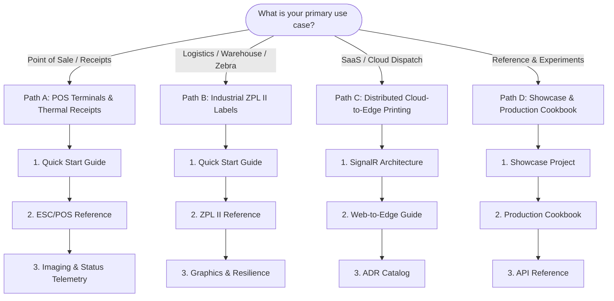

<!-- Copyright © Erickson Lopez. MIT License. -->
# Technical Documentation Hub — EricksonLopez.Printing

Welcome to the official documentation, architecture guides, and technical references for the **`EricksonLopez.Printing`** library ecosystem.

This suite provides a unified, high-performance, zero-allocation printing architecture for .NET 8.0, 9.0, and 10.0, supporting Point-of-Sale (POS) thermal receipt printers (ESC/POS) and industrial label printers (Zebra ZPL II) via raw TCP sockets, RS-232 serial COM ports, and remote SignalR cloud-to-edge tunnels.

---

## 🗺️ Recommended Learning Paths

---

## 📚 General Documentation Index

### 1. Getting Started & Learning Guides
- **[Quick Start Guide (`quick-start.md`)](quick-start.md)**: Your first ESC/POS receipt and ZPL label in under 5 minutes.
- **[Installation & Configuration Guide (`getting-started.md`)](getting-started.md)**: Package ecosystem, dependency injection (`AddTcpPrinter`, `AddKeyedTcpPrinter`, `AddPooledTcpPrinter`, `AddSerialPrinter`), environment variables, and Docker.
- **[Official Showcase Project Guide (`showcase-guide.md`)](showcase-guide.md)**: Operational guide for running the reference implementation across all 11 progressive levels (Level 00 to Level 10).
- **[Production Cookbook (`cookbook.md`)](cookbook.md)**: 10 complete, production-ready recipes solving real-world receipt and label requirements.

### 2. Architecture & Design
- **[System Architecture Guide (`architecture-guide.md`)](architecture-guide.md)**: Functional system map, processing layers, low-level streaming pipelines, concurrency models, and 6 exhaustive Mermaid diagrams.
- **[SignalR Web-to-Edge Guide (`web-to-edge-guide.md`)](web-to-edge-guide.md)**: Reverse WebSocket tunnels with ASP.NET Core SignalR for dispatching print jobs to branch edge agents across corporate firewalls.
- **[Architecture Decision Records (`adr/README.md`)](adr/README.md)**: Formal catalog of 20 architectural decisions (ADR-0001 to ADR-0020) detailing Native AOT, concurrency, memory zero-copy, and connection pooling.

### 3. Technical Reference
- **[Public API Inventory (`api-inventory.md`)](api-inventory.md)**: The single source of truth detailing all 30 public types in the suite and their coverage in the Showcase.
- **[Complete API Reference (`api-reference.md`)](api-reference.md)**: Microsoft Learn-style reference for all public interfaces, classes, structs, extension methods, and error codes.
- **[ESC/POS Command Reference (`escpos-command-reference.md`)](escpos-command-reference.md)**: Mapping of builder methods to hexadecimal ESC/POS printer bytecode opcodes.
- **[Zebra ZPL II Command Reference (`zpl-command-reference.md`)](zpl-command-reference.md)**: Mapping of standard Zebra commands (`^XA`, `^FO`, `^FD`, `^FS`, `^GB`, `^BC`, `^GF`, etc.).

### 4. Operations, Quality & Best Practices
- **[Best Practices & Physical Safety Guide (`best-practices.md`)](best-practices.md)**: The Golden Rule of Physical Idempotency, ephemeral vs persistent socket selection, and safeMode protection.
- **[Performance & Memory Guide (`performance-guide.md`)](performance-guide.md)**: Zero-allocation architecture, throughput benchmarks (>500k receipts/s), and Native AOT metrics.
- **[CI/CD, Quality & Infrastructure Guide (`ci-cd-and-quality.md`)](ci-cd-and-quality.md)**: Multi-targeting GitHub Actions workflows, 95% Stryker mutation testing gates, and release packaging.
- **[Troubleshooting & Diagnostic Guide (`troubleshooting.md`)](troubleshooting.md)**: Diagnosing `PrintingErrorCodes`, corrupted characters, socket timeouts, and COM port conflicts.
- **[Frequently Asked Questions (`faq.md`)](faq.md)**: Direct answers to questions on drivers, physical hardware, Linux compatibility, and offline testing.

### 5. Migration Guides
- **[Migration from ESCPOS_NET (`migration-from-escpos-net.md`)](migration-from-escpos-net.md)**: Replacing exception-throwing architectures with `Result<bool>` pipelines and Native AOT.
- **[Migration from BinaryKits.Zpl (`migration-from-binarykits-zpl.md`)](migration-from-binarykits-zpl.md)**: Upgrading from heap-heavy object syntax trees to zero-allocation fluent streams.

---

## ⚡ Quick Links
- [Main Repository README](../README.md)
- [Changelog (CHANGELOG.md)](../CHANGELOG.md)
- [Support Policy (SUPPORT.md)](../SUPPORT.md)
- [Security Policy (SECURITY.md)](../SECURITY.md)
- [Showcase Source Code](../samples/EricksonLopez.Printing.Showcase)
