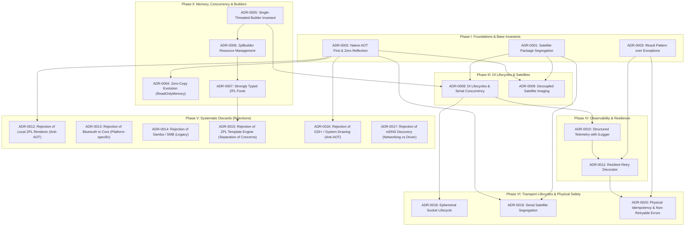

<!-- Copyright © Erickson Lopez. MIT License. -->
# Architecture Decision Records (ADRs) — EricksonLopez.Printing

This catalog formalizes the architectural decisions, technical design invariants, and non-negotiable standards for the `EricksonLopez.Printing` library ecosystem.

Rather than an arbitrary chronological log, these decisions are structured as a **causal decision graph**, where foundational decisions inform, constrain, or systematically discard subsequent architectural choices.

---

## Causal Decision Graph

---

## Sequential Decision Index

### Phase I: Architectural Foundations & Base Invariants
Establishes the non-negotiable principles of the suite: strict modularity, Native AOT compilation without reflection, and functional hardware error handling.

| ADR | Title | Status | Architectural Impact |
|---|---|---|---|
| [ADR-0001](adr-0001-package-segregation-and-satellite-architecture.md) | Package Segregation and Satellite Architecture | **Accepted** | Ultra-lightweight core; imaging and network protocols segregated. |
| [ADR-0002](adr-0002-native-aot-first-and-zero-reflection.md) | Native AOT First Compatibility and Zero Reflection | **Accepted** | JIT-free compilation invariant with strict dead-code trimming compatibility. |
| [ADR-0003](adr-0003-result-pattern-over-exceptions.md) | Result Pattern Adoption for Hardware Error Handling | **Accepted** | No exception throwing across I/O boundaries; returns `Result<bool>`. |

---

### Phase II: Concurrency, Memory & Builder Ergonomics
Defines single-threaded execution rules for bytecode composition, non-breaking zero-copy evolution, and type safety.

| ADR | Title | Status | Architectural Impact |
|---|---|---|---|
| [ADR-0004](adr-0004-memory-zero-copy-evolution.md) | Evolution Toward Zero-Copy via `ReadOnlyMemory<byte>` | **Accepted** | Non-disruptive DIM on `IPrintDocument` enabling zero-allocation socket transmission. |
| [ADR-0005](adr-0005-builder-thread-safety-invariants.md) | Single-Threaded Invariant in Command Builders | **Accepted** | Eliminates synchronization overhead in transient builders. |
| [ADR-0006](adr-0006-zpl-builder-resource-management.md) | Resource Management in `ZplBuilder` (No `IDisposable`) | **Accepted** | Pure managed `StringBuilder`; reserves `IDisposable` for unmanaged resources. |
| [ADR-0007](adr-0007-strongly-typed-zpl-fonts.md) | Typed ZPL Font Overload with `ZplFont` Enum | **Accepted** | Compile-time type safety with IDE autocomplete without breaking raw `char` overloads. |

---

### Phase III: DI Lifecycles & Satellite Graphics
Solves idiomatic integration with Microsoft Generic Host and isolates heavy mathematical algorithms in satellite packages.

| ADR | Title | Status | Architectural Impact |
|---|---|---|---|
| [ADR-0008](adr-0008-di-client-lifecycles-and-serial-concurrency.md) | DI Lifecycles and Serial COM Port Contention | **Accepted** | `Singleton` for TCP and Serial with physical hardware concurrency guidance. |
| [ADR-0009](adr-0009-decoupled-satellite-imaging-packages.md) | Graphic Processing Isolation in Satellite Packages | **Accepted** | Pure C# `EscPos.Imaging` and `Zpl.Imaging` algorithms with zero native dependencies. |

---

### Phase IV: Production Connectivity, Resilience & Observability
Equips transport clients to operate in industrial production environments with transparent diagnostics and transient fault tolerance.

| ADR | Title | Status | Architectural Impact |
|---|---|---|---|
| [ADR-0010](adr-0010-structured-logging-and-observability.md) | Structured Telemetry with Null-Logger Fallback | **Accepted** | Optional `ILogger<T>?` with standardized Event IDs across clients and dispatchers. |
| [ADR-0011](adr-0011-transient-resilience-and-retry-decorator.md) | Decorator Pattern for Transient Resilience and Retries | **Accepted** | `ResilientPrinterClient` with exponential backoff, jitter ceiling, and `TimeProvider`. |

---

### Phase V: Systematic Discards & Domain Boundaries
Formal negative architectural decisions designed to protect core purity, maintain AOT guarantees, and prevent feature creep.

| ADR | Title | Status | Rejection Reason / Recommended Alternative |
|---|---|---|---|
| [ADR-0012](adr-0012-rejection-of-local-zpl-rendering-engine.md) | Rejection of Local ZPL Label Rendering Engine | **Rejected** | Anti-AOT and non-production utility. Alternative: Labelary REST API. |
| [ADR-0013](adr-0013-rejection-of-bluetooth-transport.md) | Rejection of Bluetooth Transport in Core Suite | **Rejected** | OS-native driver coupling and fragmentation. Alternative: TCP / Serial CDC. |
| [ADR-0014](adr-0014-rejection-of-samba-and-network-file-shares.md) | Rejection of Printing via Samba/SMB Network Shares | **Rejected** | Legacy pattern dependent on OS print queues. Alternative: Raw TCP port 9100. |
| [ADR-0015](adr-0015-rejection-of-built-in-zpl-template-engine.md) | Rejection of Embedded ZPL Template Engine | **Rejected** | Application layer concern. Alternative: Fluid / Scriban + `.Raw()`. |
| [ADR-0016](adr-0016-rejection-of-windows-gdi-system-drawing.md) | Rejection of Printing via Windows GDI or System.Drawing | **Rejected** | Violates cross-platform, driverless, and Native AOT core principles. |
| [ADR-0017](adr-0017-rejection-of-mdns-printer-discovery.md) | Rejection of Automatic Printer Discovery (mDNS) | **Rejected** | Network provisioning concern outside bytecode driver responsibility. |

---

### Phase VI: Transport Lifecycles, Satellites & Physical Safety
Governs physical socket lifetimes, hardware serial port isolation, and non-retryable physical operation safety.

| ADR | Title | Status | Architectural Impact |
|---|---|---|---|
| [ADR-0018](adr-0018-connection-pooling-and-persistent-socket-lifecycle.md) | Ephemeral Connection Lifecycle over Persistent Socket Pooling | **Superseded** | Mandates connect-write-close per job for shared printers (superseded by ADR-0021 for high-volume pools). |
| [ADR-0019](adr-0019-segregation-of-serial-rs232-transport-satellite.md) | Segregation of Serial RS-232 Transport into Dedicated Satellite | **Accepted** | Isolates `System.IO.Ports` and unmanaged OS handles into `EricksonLopez.Printing.Serial`. |
| [ADR-0020](adr-0020-physical-idempotency-and-non-retryable-transmission-errors.md) | Physical Idempotency and Non-Retryable Transmission Errors | **Accepted** | Protects physical media; halts retries on mid-stream drops to prevent duplicate prints. |
| [ADR-0021](adr-0021-pooled-tcp-transport-for-high-throughput.md) | Persistent Pooled TCP Transport for High-Throughput Dedicated Printers | **Accepted** | Introduces bounded channel socket pooling for dedicated high-volume print servers. |

---

## Reading Guide
For a comprehensive architectural onboarding, start with [ADR-0001](adr-0001-package-segregation-and-satellite-architecture.md) and use the `[Next ➡️]` navigation links at the top and bottom of each document to follow the design sequence.
