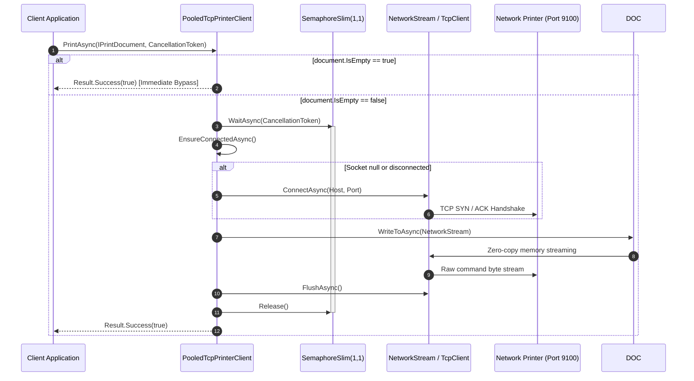
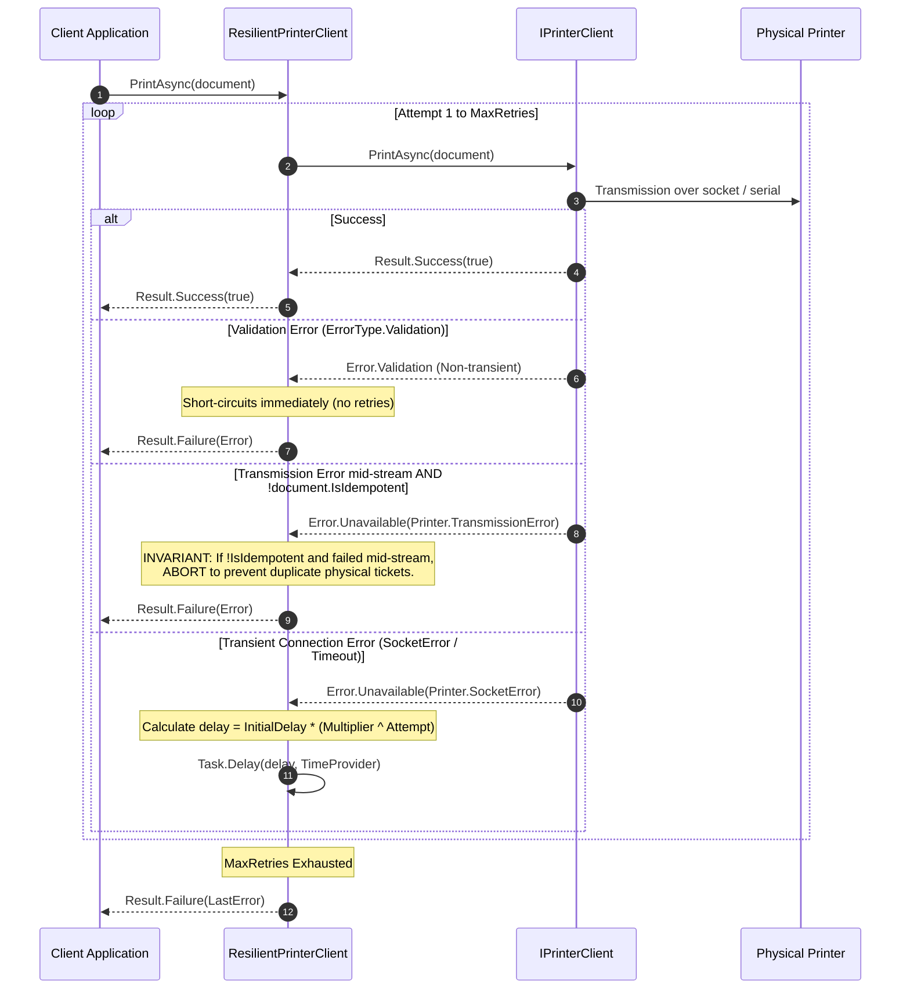
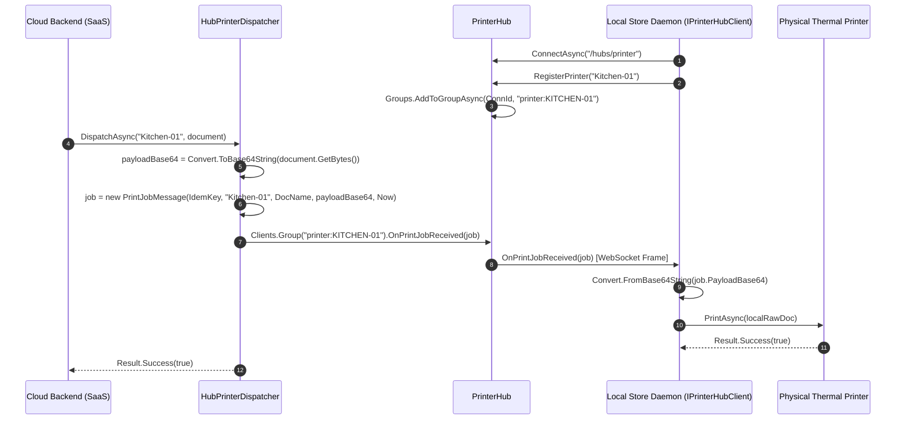
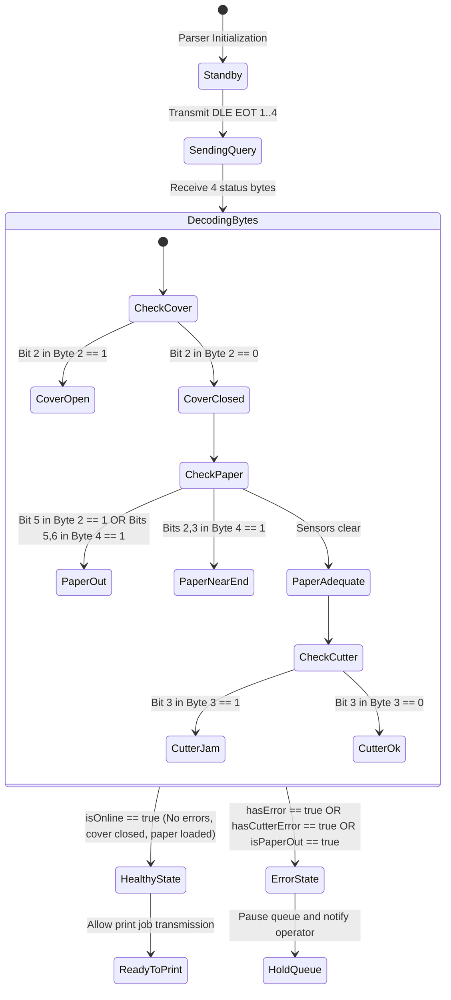
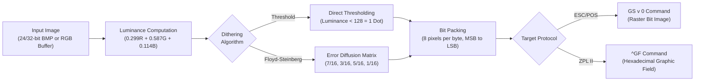

<!-- Copyright © Erickson Lopez. MIT License. -->
# System Architecture Guide — EricksonLopez.Printing

This guide details the architectural foundations, functional system map, design patterns, and structural diagrams governing the `EricksonLopez.Printing` library ecosystem.

---

## 1. Architectural Vision & Core Invariants

The `EricksonLopez.Printing` ecosystem is engineered around five fundamental principles:

1. **OS Agnosticism & Container-First Execution**:
   Complete elimination of dependencies on proprietary graphics runtimes or OS desktop print spoolers (such as GDI+, `System.Drawing`, or `winspool.drv`), enabling identical execution across Linux (Alpine, Debian, Ubuntu), Docker, Kubernetes, macOS, and Windows.

2. **Zero Runtime Reflection & Native AOT Compatibility**:
   All libraries are engineered for Ahead-of-Time compilation (`PublishAot=true`), with zero unpreserved reflection or dynamic code generation on hot execution paths.

3. **Railway-Oriented Functional Error Handling**:
   Hardware and network I/O operations report outcomes via `Result<bool>` and `Error` types from `EricksonLopez.Result`. Network disconnects and printer hardware faults are modeled as expected domain states rather than unhandled control-flow exceptions.

4. **Zero-Copy Memory Layout & LOH Avoidance**:
   Heavy utilization of `Microsoft.IO.RecyclableMemoryStream`, `ArrayPool<T>.Shared` buffers, `ReadOnlySpan<byte>`, and `ReadOnlyMemory<byte>` avoids Large Object Heap (LOH) fragmentation under continuous high-volume printing.

5. **Decoupled Satellite Package Architecture**:
   Base packages (`EricksonLopez.Printing`, `EricksonLopez.Printing.EscPos`, `EricksonLopez.Printing.Zpl`) maintain minimal dependency footprints. Heavy raster imaging (`Imaging`), hardware status monitoring (`Status`), RS-232 serial ports (`Serial`), and cloud dispatch (`SignalR`) are segregated into opt-in satellite libraries.

---

## 2. Functional System Map

```mermaid
flowchart TD
    subgraph UI_API["Application Entrypoint"]
        APP["Backend Application / POS / Worker Daemon"]
    end

    subgraph CompositionLayer["1. Composition Layer (Builders)"]
        EP_BUILDER["EscPosBuilder\n(Thermal ESC/POS Bytecode)"]
        ZP_BUILDER["ZplBuilder\n(Zebra ZPL II Label Compiler)"]
        IMG_EP["EscPos.Imaging\n(Dithering & Raster GS v 0)"]
        IMG_ZP["Zpl.Imaging\n(Dithering & Graphic Field ^GF)"]

        EP_BUILDER -.-> IMG_EP
        ZP_BUILDER -.-> IMG_ZP
    end

    subgraph DocumentLayer["2. Immutable Document Model"]
        DOC["IPrintDocument\n(DocumentName, IdempotencyKey, IsEmpty, IsIdempotent)"]
        RAW_DOC["RawPrintDocument\n(In-Memory byte[])"]
        ZPL_DOC["ZplPrintDocument\n(Optimized UTF-8 Stream)"]

        EP_BUILDER -->|Build()| RAW_DOC
        ZP_BUILDER -->|Build()| ZPL_DOC
        RAW_DOC -.->|implements| DOC
        ZPL_DOC -.->|implements| DOC
    end

    subgraph ResilienceLayer["3. Resilience & Policy Layer"]
        RETRY["ResilientPrinterClient (Decorator)"]
        POLICY["ResilientPrinterOptions\n(Exponential Backoff + Idempotency Guard)"]
        DOC --> RETRY
        POLICY -.-> RETRY
    end

    subgraph TransportLayer["4. Transport Drivers (IPrinterClient)"]
        TCP_EPHEMERAL["TcpPrinterClient\n(Ephemeral connection per-job)"]
        TCP_POOLED["PooledTcpPrinterClient\n(Persistent connection + SemaphoreSlim)"]
        SERIAL_CLIENT["SerialPrinterClient\n(RS-232 COM Port + SemaphoreSlim)"]

        RETRY -->|Delegates to| TCP_EPHEMERAL
        RETRY -->|Delegates to| TCP_POOLED
        RETRY -->|Delegates to| SERIAL_CLIENT
    end

    subgraph RemoteDispatchLayer["5. Remote Cloud-to-Edge Dispatch"]
        DISP["IHubPrinterDispatcher\n(HubPrinterDispatcher)"]
        HUB["PrinterHub\n(ASP.NET Core SignalR)"]
        EDGE_AGENT["Local Edge Daemon\n(IPrinterHubClient)"]

        DOC --> DISP
        DISP --> HUB
        HUB -->|WebSocket / PrintJobMessage| EDGE_AGENT
        EDGE_AGENT -->|Local PrintAsync| TransportLayer
    end

    subgraph PhysicalHardware["6. Physical Output Devices"]
        PRINTER_NET["Network Printer (Raw Port 9100)"]
        PRINTER_COM["Serial Printer (RS-232 / COM)"]
        STATUS_MODULE["EscPosStatusParser\n(DLE EOT Sensor Queries)"]

        TCP_EPHEMERAL --> PRINTER_NET
        TCP_POOLED --> PRINTER_NET
        SERIAL_CLIENT --> PRINTER_COM
        PRINTER_NET -.-> STATUS_MODULE
        PRINTER_COM -.-> STATUS_MODULE
    end

    APP --> CompositionLayer
```

---

## 3. Sequence & Interaction Diagrams

### 3.1. Persistent Pooled TCP Transmission (`PooledTcpPrinterClient`)



### 3.2. Resilience with Exponential Backoff & Physical Idempotency



### 3.3. Remote Web-to-Edge Dispatch with ASP.NET Core SignalR



---

## 4. Hardware Diagnostic State Machine (ESC/POS Status)



---

## 5. Monochrome Graphics Processing Pipeline



---

## 6. Layer Transitions & Separation of Concerns

1. **From Composition to Document**:
   Builders (`EscPosBuilder`, `ZplBuilder`) are mutable, single-threaded objects. Calling `.Build()` materializes an immutable `IPrintDocument` (`RawPrintDocument`, `ZplPrintDocument`) that is safe to share concurrently across threads or transmit to multiple endpoints.

2. **From Document to Transport**:
   The `IPrinterClient` abstraction consumes `IPrintDocument` and streams bytes asynchronously via `document.WriteToAsync(stream)` directly to physical socket or serial streams, avoiding memory re-allocation.

3. **From Transport to Resilience**:
   Low-level transport clients (`TcpPrinterClient`, `PooledTcpPrinterClient`, `SerialPrinterClient`) do not contain retry loops. Resilience is applied via the decorator pattern (`ResilientPrinterClient`), ensuring consistent retry behavior across any physical transport.
