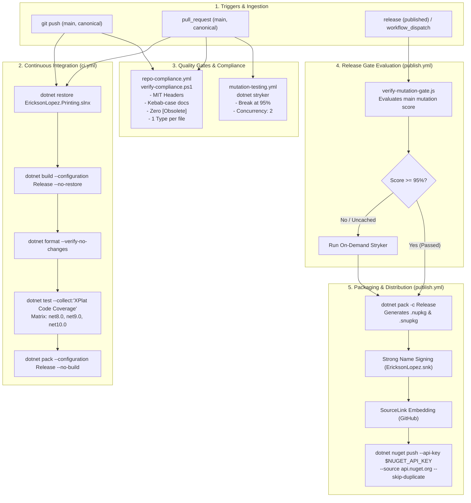
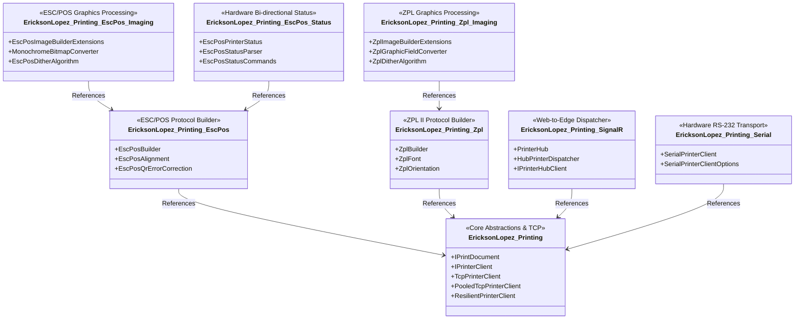

<!-- Copyright © Erickson Lopez. MIT License. -->
# Build, CI/CD, Quality Gates & NuGet Ecosystem — EricksonLopez.Printing

This document provides a comprehensive technical reference for the continuous integration, continuous delivery, quality assurance gates, supply chain security mechanisms, and NuGet packaging specifications governing the `EricksonLopez.Printing` ecosystem.

---

## 1. System Architecture & CI/CD Pipeline Flow

The deployment lifecycle enforces multi-tier validation: compilation across all target frameworks (.NET 8, 9, 10), static code analysis with zero compiler warning suppressions, test execution with cross-platform code coverage collection, automated mutation testing with Stryker.NET, zero-tolerance compliance checks, and a cryptographically signed package distribution pipeline.



---

## 2. GitHub Actions Workflows Inventory

All automated pipelines are located in `.github/workflows/`. Every workflow runs in strict sandboxed Linux runners (`ubuntu-latest`).

### 2.1 Continuous Integration (`.github/workflows/ci.yml`)

* **Purpose:** Validates compilation, code formatting, test suites, cross-platform coverage, and packaging readiness across all target frameworks.
* **Triggers:**
  * `push` to branches: `[main, canonical]`
  * `pull_request` to branches: `[main, canonical]`
* **Permissions:** `contents: read`, `checks: write`, `pull-requests: write`
* **Execution Matrix:**
  * `dotnet-version`: `['8.0.x', '9.0.x', '10.0.x']` (runs across .NET 8, 9, and 10 runtimes)
* **Pipeline Steps:**
  1. **Checkout Code:** `actions/checkout@v4` with `fetch-depth: 0`.
  2. **Setup .NET SDKs:** `actions/setup-dotnet@v4` installing SDKs 8.0.x, 9.0.x, and 10.0.x.
  3. **Restore Dependencies:** `dotnet restore EricksonLopez.Printing.slnx` using Central Package Management (CPM).
  4. **Build Solution:** `dotnet build EricksonLopez.Printing.slnx --configuration Release --no-restore`.
  5. **Verify Code Formatting:** `dotnet format EricksonLopez.Printing.slnx --verify-no-changes --verbosity diagnostic`.
  6. **Run Test Suites with Coverage:**
     ```bash
     dotnet test EricksonLopez.Printing.slnx \
       --configuration Release \
       --no-build \
       --collect:"XPlat Code Coverage" \
       --logger "trx;LogFileName=test-results.trx" \
       --results-directory ./TestResults
     ```
  7. **Verify NuGet Packaging:** `dotnet pack EricksonLopez.Printing.slnx --configuration Release --no-build --output ./artifacts-pack`.
* **Artifacts Produced:** Test results (`test-results.trx`) and Coverlet coverage reports (`coverage.cobertura.xml`).
* **Secrets Required:** None.

---

### 2.2 Mutation Testing (`.github/workflows/mutation-testing.yml`)

* **Purpose:** Executes mutation analysis via Stryker.NET to prove test suite efficacy against semantic mutant injections.
* **Triggers:**
  * `pull_request` to `[main, canonical]` on changes affecting `src/**`, `tests/**`, `stryker-config.json`, or the workflow file.
  * `push` to `main`.
  * `workflow_dispatch` (manual execution).
  * `workflow_call` (reusable workflow called by `publish.yml`).
* **Inputs (for `workflow_call`):**
  * `mutation-level`: String (Default: `"Standard"`).
* **Permissions:** `contents: read`, `pull-requests: write`.
* **Pipeline Steps:**
  1. **Tooling Restore:** Restores local .NET tools or installs `dotnet-stryker` globally.
  2. **Baseline Cache:** Uses `actions/cache@v4` on `~/.stryker` keyed by runner OS and commit SHA to speed up incremental runs.
  3. **Targeted PR Execution:** Runs `dotnet stryker --config-file stryker-config.json --since:origin/main --concurrency:2 --break-at:95`.
  4. **Full Execution:** Runs on `main` branch merges without `--since` filter with `--break-at:95`.
  5. **Upload Mutation Report:** Publishes HTML/JSON mutation reports to GitHub artifacts (`retention-days: 14`).
* **Quality Thresholds:**
  * **Break Threshold:** 95% (build fails if mutation score drops below 95%).
  * **Low Threshold:** 98%.
  * **High Threshold:** 100%.

---

### 2.3 Repository Compliance & Governance (`.github/workflows/repo-compliance.yml`)

* **Purpose:** Enforces zero-tolerance repository governance, architectural invariants, code cleanliness, and documentation integrity.
* **Triggers:**
  * `pull_request` to `[main, canonical]`
  * `push` to `[main, canonical]`
  * `workflow_dispatch`
* **Audit Checks:**
  1. **PowerShell Compliance Verifier:** Executes `./scripts/verify-compliance.ps1`.
  2. **Kebab-Case Markdown Governance:** Verifies that all files in `docs/` adhere strictly to `kebab-case.md`. Exempts standard root files (`README.md`, `CHANGELOG.md`, `CONTRIBUTING.md`, `CODE_OF_CONDUCT.md`, `SECURITY.md`, `LICENSE`, `SUPPORT.md`, `ROADMAP.md`, `GOVERNANCE.md`, `PULL_REQUEST_TEMPLATE.md`).
  3. **Canonical MIT Copyright Header:** Scans all `.cs` files to guarantee line 1 contains `// Copyright © Erickson Lopez. MIT License.`.
  4. **Zero Obsolete Usages:** Asserts that zero `[Obsolete]` attributes exist in production code (ensures clean APIs without legacy baggage).
  5. **Zero CS1591 Suppressions:** Prohibits suppressing compiler warning CS1591 (missing XML documentation comments on public members).
* **Secrets Required:** None.

---

### 2.4 Package Publishing (`.github/workflows/publish.yml`)

* **Purpose:** Orchestrates the release pipeline to package and deploy all 8 NuGet libraries to NuGet.org upon verified quality gates.
* **Triggers:**
  * GitHub Release: `types: [ published ]`
  * `workflow_dispatch`: with optional `version` input string.
* **Permissions:** `contents: read`.
* **Jobs & Inter-Workflow Dependencies:**
  * **Job 1: `mutation-gate-check`:** Executes Node.js release gate script `scripts/verify-mutation-gate.js` via `actions/github-script@v7`. Assesses whether the evaluated commit on `main` meets the 95% mutation score baseline.
  * **Job 2: `stryker-gate` (Conditional):** If `needs_stryker == 'true'`, invokes reusable workflow `./.github/workflows/mutation-testing.yml` with `mutation-level: "Standard"`.
  * **Job 3: `publish`:** Runs only if mutation quality checks succeed.
    1. Builds solution in `Release` configuration.
    2. Executes test suites.
    3. Runs `dotnet pack EricksonLopez.Printing.slnx --configuration Release --no-build --output ./artifacts-pack`.
    4. Deploys packages:
       ```bash
       dotnet nuget push ./artifacts-pack/*.nupkg \
         --api-key "$NUGET_API_KEY" \
         --source https://api.nuget.org/v3/index.json \
         --skip-duplicate
       ```
* **Secrets Required:**
  * `NUGET_API_KEY`: Secret API token authorized to push packages under the `EricksonLopez.Printing` namespace on NuGet.org.

---

## 3. Build & Packaging Configuration

### 3.1 Centralized MSBuild Properties (`Directory.Build.props`)

Build properties are centralized at the repository root to guarantee strict consistency across all projects:

| Property | Value | Architectural Justification |
|---|---|---|
| `<TargetFrameworks>` | `net8.0;net9.0;net10.0` | Multi-targeting .NET 8 LTS, .NET 9 STS, and .NET 10 preview. |
| `<LangVersion>` | `latest` | Modern C# language features across all libraries. |
| `<Nullable>` | `enable` | Strict null-safety enforcement. |
| `<ImplicitUsings>` | `enable` | Clean, standardized imports. |
| `<TreatWarningsAsErrors>` | `true` | Zero-warning policy across the entire solution. |
| `<WarningLevel>` | `5` | Highest compiler diagnostic sensitivity. |
| `<AnalysisLevel>` | `latest-recommended` | Recommended Roslyn code quality and security rules. |
| `<IsAotCompatible>` | `true` | Enforces Native AOT trimming and static compilation checks. |
| `<EnableTrimAnalyzer>` | `true` | Flags reflection or dynamic features that break dead-code trimming. |
| `<SignAssembly>` | `true` | Enables strong-name assembly signing when `EricksonLopez.snk` is present. |
| `<PublishRepositoryUrl>` | `true` | SourceLink metadata embedded into assemblies. |
| `<SymbolPackageFormat>` | `snupkg` | Generates portable PDB symbol packages alongside `.nupkg`. |

### 3.2 Strong Name Signing

All release assemblies are strong-named using `EricksonLopez.snk`. The public key token is declared in `Directory.Build.props`:

* **Public Key:** `0024000004800000940000000602000000240000525341310004000001000100655c867cb6d2e3a8d53e10d858994a49ea6b428de6e1e2eec19c71f0409345a7bf1649e9208282982347d90153f237f1aef003468e4a913598faa0b96815de53ede401790587fef88c7869884cdbf4372e74a44facf7dd6995e9b832285f8c548f531e1886d6712632139b617cd4f13988021b7cc32b5c3af18f52e19ae2a6cc`
* **Constant:** `SIGN_ASSEMBLY` defined when signed.

### 3.3 Central Package Management (`Directory.Packages.props`)

All external NuGet package versions are pinned centrally to prevent diamond dependency conflicts:

| Package Identity | Version | Scope |
|---|---|---|
| `Microsoft.SourceLink.GitHub` | `8.0.0` | Global Build Tooling |
| `EricksonLopez.Result` | `2.0.0` | Core Functional Return Types |
| `Microsoft.Extensions.DependencyInjection.Abstractions` | `10.0.11` | Dependency Injection Interfaces |
| `Microsoft.Extensions.DependencyInjection` | `10.0.11` | DI Container |
| `Microsoft.Extensions.Logging.Abstractions` | `10.0.11` | Telemetry & Logging Abstractions |
| `Microsoft.IO.RecyclableMemoryStream` | `3.0.1` | High-performance pooled streams |
| `System.IO.Ports` | `9.0.0` | Serial COM Port Transports |
| `BenchmarkDotNet` | `0.15.8` | Micro-benchmarking framework |
| `Microsoft.NET.Test.Sdk` | `18.9.0` | Test Runner SDK |
| `xunit` | `2.9.3` | Unit Testing Framework |
| `xunit.runner.visualstudio` | `4.0.0` | Visual Studio / VSTest Runner |
| `AwesomeAssertions` | `9.6.0` | Fluent Assertions |
| `NSubstitute` | `5.3.0` | Mocking Subsystem |
| `coverlet.collector` | `10.0.1` | Cross-Platform Code Coverage |

---

## 4. NuGet Library Ecosystem Matrix

The suite produces **8 distinct NuGet packages**, engineered around the Single Responsibility Principle:



### 4.1 Package Specifications

| Package ID | Project Path | Target Frameworks | Direct Dependencies | Purpose |
|---|---|---|---|---|
| `EricksonLopez.Printing` | `src/EricksonLopez.Printing/` | `net8.0;net9.0;net10.0` | `EricksonLopez.Result`<br/>`Microsoft.Extensions.Logging.Abstractions`<br/>`Microsoft.Extensions.DependencyInjection.Abstractions`<br/>`Microsoft.IO.RecyclableMemoryStream` | Core print documents, TCP client, pooled client, resilient retry decorator, and DI extensions. |
| `EricksonLopez.Printing.EscPos` | `src/EricksonLopez.Printing.EscPos/` | `net8.0;net9.0;net10.0` | `EricksonLopez.Printing` | Pure managed ESC/POS receipt builder with zero reflection. |
| `EricksonLopez.Printing.EscPos.Imaging` | `src/EricksonLopez.Printing.EscPos.Imaging/` | `net8.0;net9.0;net10.0` | `EricksonLopez.Printing.EscPos` | High-performance bitmap dithering (Floyd-Steinberg, Atkinson, Bayer) and ESC/POS raster column encoding. |
| `EricksonLopez.Printing.EscPos.Status` | `src/EricksonLopez.Printing.EscPos.Status/` | `net8.0;net9.0;net10.0` | `EricksonLopez.Printing.EscPos` | Real-time bi-directional status query parsing (paper out, drawer open, cover status). |
| `EricksonLopez.Printing.Zpl` | `src/EricksonLopez.Printing.Zpl/` | `net8.0;net9.0;net10.0` | `EricksonLopez.Printing` | Fluent ZPL II label builder (barcodes, boxes, QR, text fonts, rotations). |
| `EricksonLopez.Printing.Zpl.Imaging` | `src/EricksonLopez.Printing.Zpl.Imaging/` | `net8.0;net9.0;net10.0` | `EricksonLopez.Printing.Zpl` | Image processing and `^GF` graphic field ASCII hex encoding for Zebra printers. |
| `EricksonLopez.Printing.SignalR` | `src/EricksonLopez.Printing.SignalR/` | `net8.0;net9.0;net10.0` | `EricksonLopez.Printing` | Real-time Web-to-Edge printing hub, dispatcher, and client abstractions. |
| `EricksonLopez.Printing.Serial` | `src/EricksonLopez.Printing.Serial/` | `net8.0;net9.0;net10.0` | `EricksonLopez.Printing`<br/>`System.IO.Ports` | Hardware RS-232 / Virtual COM Port serial printer client. |

---

## 5. Branch & Versioning Strategy

### 5.1 Branching Model

* **`main`:** The production trunk. All releases and tags (`v*.*.*`) are cut from `main`. Direct pushes are restricted; changes land via pull requests passing CI, compliance, and mutation quality gates.
* **`canonical`:** The shared integration trunk for upstream synchronization and verified cross-framework builds.

### 5.2 Release & Tagging Strategy

* Versioning adheres to [Semantic Versioning 2.0.0](https://semver.org/).
* The current package version is set centrally in `Directory.Build.props` via `<VersionPrefix>`.
* Tags follow the format `v{Major}.{Minor}.{Patch}` (e.g. `v1.0.0`).
* Creating a GitHub Release automatically executes `.github/workflows/publish.yml`, which runs quality assertion checks before uploading `.nupkg` and `.snupkg` artifacts to NuGet.org.

---

## 6. Supply Chain Security Invariants

1. **Deterministic Builds:** Compiler parameters enforce deterministic outputs across machines.
2. **Reproducible Sources via SourceLink:** Every package embeds Git commit SHAs and maps file paths directly to the public GitHub repository.
3. **Strong Naming:** Cryptographically verifies assembly identity and prevents DLL spoofing.
4. **Centralized Dependencies (CPM):** Prohibits individual project files from specifying ad-hoc dependency versions.
5. **No Static API Key Exposure:** Secret keys are injected exclusively in protected CI pipeline step environments.
