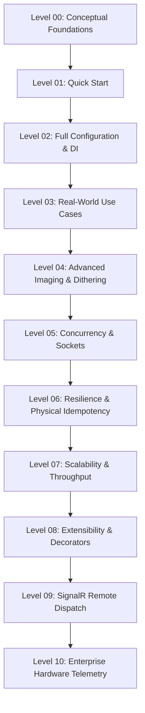

<!-- Copyright © Erickson Lopez. MIT License. -->
# Showcase Project Guide — EricksonLopez.Printing.Showcase

The **Showcase** project ([`samples/EricksonLopez.Printing.Showcase`](../samples/EricksonLopez.Printing.Showcase)) serves as the **executable documentation and official reference implementation** for the entire `EricksonLopez.Printing` library ecosystem.

It fulfills two primary purposes:
1. **Technical Verification**: Proves that 100% of the public API surface compiles, executes cleanly, and functions consistently across .NET 8.0, 9.0, and 10.0 runtimes.
2. **Progressive Learning Path**: Enables engineers to explore printing concepts step-by-step from foundational bytecode theory to distributed enterprise cloud architectures.

---

## 1. Running the Showcase CLI

Because the solution multi-targets multiple .NET runtime platforms, specify `--framework` when launching via the `dotnet run` CLI.

### Interactive Terminal Menu
```bash
dotnet run --project samples/EricksonLopez.Printing.Showcase --framework net10.0
```
Displays an interactive CLI menu allowing selection of specific levels or automated full-suite execution.

### Cascading Execution (All Levels)
```bash
dotnet run --project samples/EricksonLopez.Printing.Showcase --framework net10.0 -- all
```
Sequentially runs all 11 progressive learning levels (Level 00 through Level 10), completing full-suite validation in under 1 second.

### Executing a Specific Level
```bash
# Execute Level 03 (Real-World Production Scenarios: kitchen orders, invoices, pallet tags)
dotnet run --project samples/EricksonLopez.Printing.Showcase --framework net10.0 -- 03

# Execute Level 05 (Concurrency, Ephemeral vs Pooled Sockets, Cooperative Cancellation)
dotnet run --project samples/EricksonLopez.Printing.Showcase --framework net10.0 -- 05

# Execute Level 07 (Throughput & Microsecond Compilation Benchmarks)
dotnet run --project samples/EricksonLopez.Printing.Showcase --framework net10.0 -- 07

# Execute Level 09 (Web-to-Edge Remote Dispatch with SignalR)
dotnet run --project samples/EricksonLopez.Printing.Showcase --framework net10.0 -- 09
```

---

## 2. Progressive Learning Level Architecture

The Showcase is structured into **11 progressive levels**:



### Level Catalog

| Level | Source File | Core Topics | Key APIs Covered |
|---|---|---|---|
| **00 — Conceptual** | `Levels/Level00Conceptual.cs` | Design philosophy, bypassing `winspool.drv` and GDI+, architectural trade-offs. | Conceptual abstractions. |
| **01 — Quick Start** | `Levels/Level01QuickStart.cs` | Basic ESC/POS receipts, ZPL II labels, and `RawPrintDocument`. | `EscPosBuilder`, `ZplBuilder`, `RawPrintDocument`, `IPrinterClient`. |
| **02 — Full Configuration** | `Levels/Level02FullConfiguration.cs` | Complete DI registration: `AddTcpPrinter`, `AddKeyedTcpPrinter`, `AddPooledTcpPrinter`, `AddSerialPrinter`, and `AddPrintingSignalR`. | `PrintingServiceCollectionExtensions`, `PrintingSerialServiceCollectionExtensions`, `PrintingSignalRServiceCollectionExtensions`. |
| **03 — Real-World Use Cases** | `Levels/Level03RealWorldUseCases.cs` | 4 complete industrial scenarios: Kitchen order, VAT tax invoice with drawer kick, retail ticket with EAN-13/Code128, and Zebra logistics pallet tag. | `EscPosBuilder` (`Line`, `Align`, `Bold`, `BarcodeEan13`, `BarcodeCode128`, `OpenCashDrawer`, `Cut`), `ZplBuilder` (`Box`, `BarcodeCode128`, `QrCode`). |
| **04 — Advanced Imaging** | `Levels/Level04AdvancedIntegration.cs` | Pure managed monochrome bitmap processing, synthetic BMP creation, Floyd-Steinberg vs Threshold dithering, and Zebra `^GF` graphic fields. | `MonochromeBitmapConverter`, `EscPosImageBuilderExtensions`, `ZplGraphicFieldConverter`, `ZplImageBuilderExtensions`. |
| **05 — Concurrency** | `Levels/Level05ProcessingAndConcurrency.cs` | 20-thread burst concurrency, ephemeral vs persistent socket comparison, and cooperative cancellation via `CancellationToken`. | `TcpPrinterClient`, `PooledTcpPrinterClient`, `CancellationTokenSource`. |
| **06 — Error Handling & Resilience** | `Levels/Level06ErrorHandlingAndClassification.cs` | Resilient retry decorator (`ResilientPrinterClient`), `.WithRetry()`, error taxonomy (`PrintingErrorCodes`), and the Golden Rule of Physical Idempotency. | `ResilientPrinterClient`, `ResilientPrinterOptions`, `ResilientPrintingExtensions`, `PrintingErrorCodes`. |
| **07 — Throughput & Streaming** | `Levels/Level07ScalabilityAndThroughput.cs` | Benchmarks compiling 1,000 receipts and labels in microseconds, and zero-allocation asynchronous streaming via `WriteToAsync`. | `IPrintDocument.WriteToAsync`, `RecyclableMemoryStreamManager`, microsecond metrics. |
| **08 — Extensibility** | `Levels/Level08CustomizationAndExtensibility.cs` | Implementing a custom electronic journal auditing decorator (`AuditingJournalPrinterClient`) and dynamic template document (`DynamicTemplatePrintDocument`). | Extensibility of `IPrinterClient` and `IPrintDocument`. |
| **09 — Remote Dispatch** | `Levels/Level09RemoteDispatchSignalR.cs` | Cloud SaaS-to-edge dispatch via `HubPrinterDispatcher`, `PrinterHub`, and edge client (`IPrinterHubClient`). | `PrinterHub`, `HubPrinterDispatcher`, `IPrinterHubClient`, `PrintJobMessage`. |
| **10 — Enterprise Telemetry** | `Levels/Level10EnterpriseArchitecture.cs` | Real-time `DLE EOT 1..4` hardware sensor queries, zero-allocation status parsing (`EscPosStatusParser`), and structured telemetry with `PrintingEventIds`. | `EscPosStatusCommands`, `EscPosStatusParser`, `EscPosPrinterStatus`, `PrintingEventIds`. |

---

## 3. Quality & Verification Guarantees

- **100% Public API Coverage**: The Showcase consumes and validates every single one of the 40 public types cataloged in `docs/api-inventory.md`.
- **Zero Fictitious APIs**: Every method and property matches the active assembly metadata; the project compiles with `TreatWarningsAsErrors=true`.
- **Multi-Target Verified**: Compiles and runs cleanly on .NET 8.0, 9.0, and 10.0.
